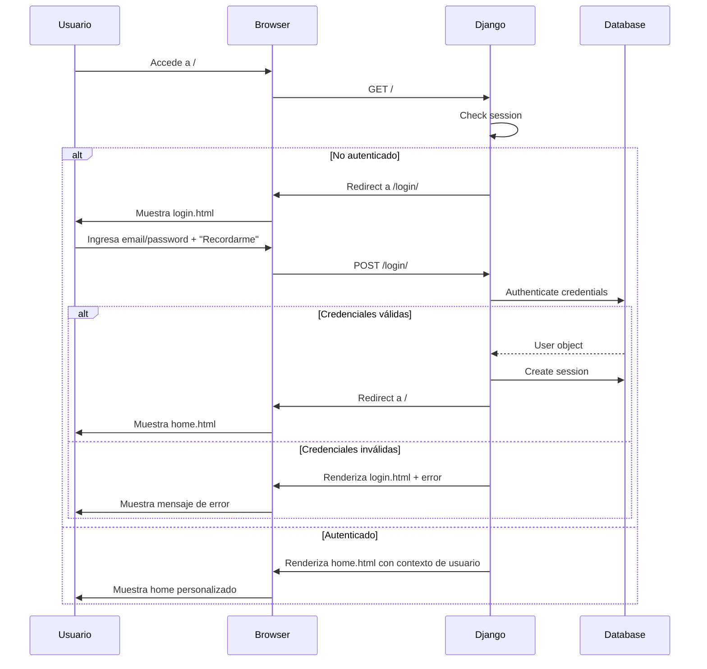
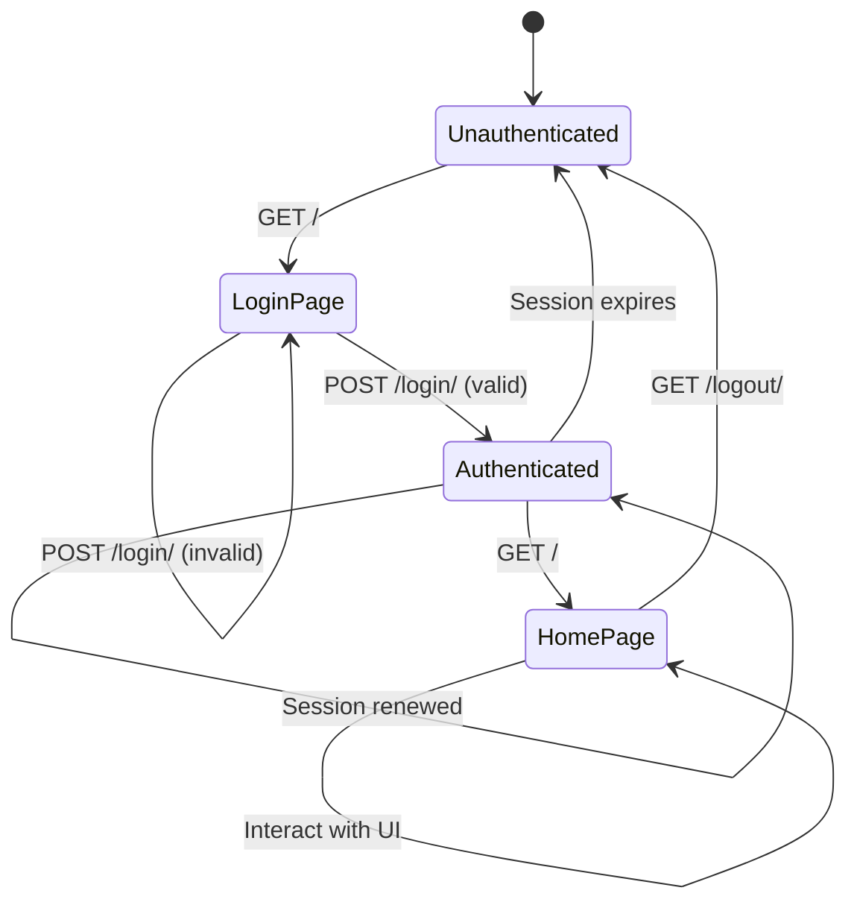

# Design Document

## Introduction

Este documento describe el diseño técnico detallado para el spec `base-django-login-home`, que establece la base Django de Personal Stock. El diseño cubre la creación del proyecto Django desde cero en `./app/`, la integración de los templates HTML existentes desde `./templates`, el sistema de autenticación con sesión persistente, y el reemplazo del usuario hardcodeado "Benja" por datos dinámicos del usuario logueado.

**Decisión de arquitectura confirmada:** `cs-chat-rag` es un proyecto independiente basado en n8n + nginx + PostgreSQL + vanilla JavaScript. NO es un proyecto Django ni contiene código Python reutilizable. Por lo tanto, `./app` se crea completamente desde cero usando `django-admin startproject`. Solo se reutilizarán de `cs-chat-rag`: el schema PostgreSQL de memoria conversacional (en spec futuro), el patrón de orquestación n8n (en spec futuro), y la inspiración visual de los templates ya migrados a `./templates`.

**Alcance de este spec:** Bootstrap Django, configuración de base de datos, templates, static files, autenticación básica con sesión persistente, integración visual de login y home, y reemplazo de usuario hardcodeado.

**Fuera de alcance:** Permisos por perfil/rol (spec `usuarios-demo-perfiles-permisos`), integración con n8n (spec `home-chat-orchestrator-contract`), trazabilidad (spec `acciones-trazabilidad-metricas`).

---

## Overview

### Arquitectura General

Personal Stock es una aplicación web Django que sirve como plataforma de apoyo a Comunicación Interna y Cultura. La arquitectura para este spec base consiste en:

```
┌─────────────────────────────────────────────────────────────┐
│                     Browser (Usuario)                       │
└──────────────────────────┬──────────────────────────────────┘
                           │ HTTPS
                           ▼
┌─────────────────────────────────────────────────────────────┐
│                    Django Application                        │
│  ┌──────────────────────────────────────────────────────┐  │
│  │              Django Auth Middleware                   │  │
│  └──────────────────────────────────────────────────────┘  │
│  ┌──────────────────────────────────────────────────────┐  │
│  │  Views Layer                                          │  │
│  │  - login_view (renders templates/login.html)         │  │
│  │  - home_view (renders templates/home.html)           │  │
│  │  - logout_view (destroys session)                    │  │
│  └──────────────────────────────────────────────────────┘  │
│  ┌──────────────────────────────────────────────────────┐  │
│  │  Templates (consumed from ./templates)               │  │
│  │  - login.html (formulario de autenticación)          │  │
│  │  - home.html (interfaz principal con prompt)         │  │
│  └──────────────────────────────────────────────────────┘  │
│  ┌──────────────────────────────────────────────────────┐  │
│  │  Static Assets (served from ./templates/*)          │  │
│  │  - css/styles.css, css/login.css                     │  │
│  │  - js/app.js, js/login.js                            │  │
│  │  - img/personal-stock-logo.svg                       │  │
│  └──────────────────────────────────────────────────────┘  │
└──────────────────────────┬──────────────────────────────────┘
                           │
                           ▼
                   ┌───────────────┐
                   │   SQLite DB   │
                   │ (db.sqlite3)  │
                   └───────────────┘
```

### Flujo de Autenticación



### Estructura de Carpetas

```
~/Desktop/PS-edit/
  app/                          # ← NUEVO: Proyecto Django creado desde cero
    manage.py                   # Script de gestión Django
    config/                     # ← django-admin startproject config .
      __init__.py
      settings.py               # Configuración principal
      urls.py                   # Rutas principales
      wsgi.py                   # WSGI entry point
      asgi.py                   # ASGI entry point
    core/                       # ← NUEVA app Django principal
      __init__.py
      admin.py
      apps.py
      models.py                 # Modelos (User por defecto en este spec)
      views.py                  # login_view, home_view, logout_view
      urls.py                   # Rutas de core
      tests.py
      migrations/
        __init__.py
    db.sqlite3                  # Base de datos SQLite
    requirements.txt            # Dependencias Python
  templates/                    # ← EXISTENTE: Templates HTML fuente (NO se copian)
    home.html                   # Template home (consumido por Django)
    login.html                  # Template login (consumido por Django)
    css/
      styles.css                # Estilos de home
      login.css                 # Estilos de login
    js/
      app.js                    # Lógica de home (SE MODIFICA: reemplazo de "Benja")
      login.js                  # Lógica de login
    img/
      personal-stock-logo.svg   # Logo principal
      personal-stock-logo-light.svg  # Logo modo claro
```

---

## Architecture

### Django Project Structure

El proyecto Django se crea en `./app/` usando el comando `django-admin startproject config .` dentro del directorio `app/`. Esta decisión coloca los archivos de configuración en una carpeta `config/` y mantiene `manage.py` en la raíz de `./app/`, siguiendo la convención moderna de proyectos Django.

**Justificación de naming:**

- `config/` en lugar de `personal_stock/` hace explícito que contiene configuración, no lógica de negocio
- La app principal se llama `core/` y contendrá la lógica base (autenticación, vistas, modelos)
- Esto facilita agregar más apps Django en specs futuros (ej: `communication`, `metrics`)

### Configuración de Settings.py

**Variables de entorno obligatorias:**

- `DATABASE_URL`: Conexión a base de datos parseada por `dj-database-url`
- `DJANGO_SECRET_KEY`: Secret key para sesiones y CSRF

**Configuración de templates:**

```python
TEMPLATES = [
    {
        'BACKEND': 'django.template.backends.django.DjangoTemplates',
        'DIRS': [BASE_DIR.parent / 'templates'],  # ← Apunta a ./templates fuera de ./app
        'APP_DIRS': True,
        'OPTIONS': {
            'context_processors': [
                'django.template.context_processors.debug',
                'django.template.context_processors.request',
                'django.contrib.auth.context_processors.auth',
                'django.contrib.messages.context_processors.messages',
            ],
        },
    },
]
```

**Configuración de static files:**

```python
STATIC_URL = '/static/'
STATIC_ROOT = BASE_DIR / 'staticfiles'
STATICFILES_DIRS = [
    BASE_DIR.parent / 'templates' / 'css',
    BASE_DIR.parent / 'templates' / 'js',
    BASE_DIR.parent / 'templates' / 'img',
]
```

**Configuración de base de datos:**

```python
import dj_database_url

DATABASES = {
    'default': dj_database_url.parse(
        os.environ.get('DATABASE_URL'),
        conn_max_age=600
    )
}
```

**Configuración de sesiones:**

```python
SESSION_ENGINE = 'django.contrib.sessions.backends.db'
SESSION_COOKIE_AGE = 1209600  # 2 semanas
SESSION_SAVE_EVERY_REQUEST = False
SESSION_COOKIE_SECURE = False  # True en producción con HTTPS
SESSION_COOKIE_HTTPONLY = True
SESSION_COOKIE_SAMESITE = 'Lax'
```

### URL Routing

**config/urls.py (URLs principales):**

```python
from django.contrib import admin
from django.urls import path, include

urlpatterns = [
    path('admin/', admin.site.urls),
    path('', include('core.urls')),
]
```

**core/urls.py (URLs de la app core):**

```python
from django.urls import path
from . import views

app_name = 'core'

urlpatterns = [
    path('', views.home_view, name='home'),
    path('login/', views.login_view, name='login'),
    path('logout/', views.logout_view, name='logout'),
]
```

### Middleware Stack

El orden de middleware en `settings.py` es crítico para el funcionamiento correcto:

```python
MIDDLEWARE = [
    'django.middleware.security.SecurityMiddleware',
    'django.contrib.sessions.middleware.SessionMiddleware',  # ← Gestiona sesiones
    'django.middleware.common.CommonMiddleware',
    'django.middleware.csrf.CsrfViewMiddleware',
    'django.contrib.auth.middleware.AuthenticationMiddleware',  # ← Gestiona autenticación
    'django.contrib.messages.middleware.MessageMiddleware',
    'django.middleware.clickjacking.XFrameOptionsMiddleware',
]
```

**Justificación del orden:**

1. `SessionMiddleware` primero para que los datos de sesión estén disponibles
2. `AuthenticationMiddleware` después para que pueda acceder a la sesión y cargar `request.user`
3. `MessageMiddleware` después para poder enviar mensajes flash al usuario autenticado

---

## Components and Interfaces

### Views Layer

**core/views.py:**

#### login_view

**Responsabilidad:** Renderizar formulario de login y procesar autenticación.

**Signature:**

```python
def login_view(request):
    """
    GET: Renderiza templates/login.html
    POST: Autentica usuario y crea sesión
    """
    pass
```

**Comportamiento GET:**

- Renderiza `login.html` sin contexto adicional
- Si el usuario ya está autenticado, redirige a `/`

**Comportamiento POST:**

- Recibe `email` y `password` del formulario
- Usa `email` como `username` (Django auth espera username, no email por defecto)
- Llama a `authenticate(request, username=email, password=password)`
- Si autenticación exitosa:
  - Llama a `login(request, user)` para crear sesión
  - Si checkbox "Recordarme" marcado: `request.session.set_expiry(1209600)` (2 semanas)
  - Si NO marcado: `request.session.set_expiry(0)` (sesión de navegador)
  - Redirige a `/`
- Si autenticación falla:
  - Renderiza `login.html` con mensaje de error en contexto
  - Mensaje: "Email o contraseña incorrectos"

#### home_view

**Responsabilidad:** Renderizar home con datos del usuario logueado.

**Signature:**

```python
@login_required
def home_view(request):
    """
    Renderiza templates/home.html con contexto de usuario
    Requiere autenticación (decorador @login_required)
    """
    pass
```

**Comportamiento:**

- Requiere autenticación vía decorador `@login_required`
- Si usuario no autenticado, redirige automáticamente a `/login/`
- Renderiza `home.html` con contexto:
  ```python
  context = {
      'user': request.user,
      'ps_user_data': {
          'firstName': request.user.first_name or request.user.username,
          'username': request.user.username,
          'email': request.user.email,
      }
  }
  ```
- El contexto `ps_user_data` se serializa a JSON y se inyecta en el template como `window.PS_USER`

#### logout_view

**Responsabilidad:** Destruir sesión y redirigir a login.

**Signature:**

```python
def logout_view(request):
    """
    Destruye la sesión actual y redirige a /login/
    """
    pass
```

**Comportamiento:**

- Llama a `logout(request)` para destruir sesión
- Redirige a `/login/`
- No requiere autenticación previa (logout es idempotente)

### Template Integration

#### login.html

**Ubicación:** `./templates/login.html`

**Modificaciones necesarias:**

1. **Agregar template tags de Django:**

```django

```

2. **Actualizar referencias a assets:**

```django
<!-- Antes -->
<link rel="stylesheet" href="css/login.css" />

<!-- Después -->
<link rel="stylesheet" href="" />
```

3. **Actualizar action del formulario:**

```django
<form class="login-form" id="loginForm" method="post" novalidate>
  
  <!-- Campos del formulario -->
</form>
```

4. **Mostrar mensajes de error:**

```django

<div class="login-error">{{ error }}</div>

```

#### home.html

**Ubicación:** `./templates/home.html`

**Modificaciones necesarias:**

1. **Agregar template tags de Django:**

```django

```

2. **Actualizar referencias a assets:**

```django
<!-- Antes -->
<link rel="stylesheet" href="css/styles.css">


<!-- Después -->
<link rel="stylesheet" href="">

```

3. **Reemplazar saludo hardcodeado:**

```django
<!-- Antes -->
<span id="welcomeTitle">Hola, Benja.</span>

<!-- Después -->
<span id="welcomeTitle">Hola, {{ user.first_name|default:user.username }}.</span>
```

4. **Inyectar datos de usuario para JavaScript:**

```django
<!-- Antes de cargar app.js -->
<script>
  window.PS_USER = {
    firstName: "{{ user.first_name|default:user.username }}",
    username: "{{ user.username }}",
    email: "{{ user.email }}"
  };
</script>
<script src=""></script>
```

5. **Actualizar menú de usuario (dropdown):**

```django
<div class="dd-head">
  <span class="avatar">{{ user.first_name.0|upper }}{{ user.last_name.0|upper }}</span>
  <div>
    <div class="nm">{{ user.first_name }} {{ user.last_name }}</div>
    <small>{{ user.email }}</small>
  </div>
</div>
```

6. **Hacer funcional el botón "Cerrar sesión":**

```django
<div class="dd-item danger" onclick="window.location.href=''">
  <span class="ico"><i class="fa-solid fa-right-from-bracket"></i></span>Cerrar sesión
</div>
```

### JavaScript Modifications

#### app.js

**Ubicación:** `./templates/js/app.js`

**Modificaciones necesarias:**

1. **Reemplazar RANDOM_GREETINGS con referencia dinámica:**

```javascript
// Antes
const RANDOM_GREETINGS = [
  "Hola Benja!",
  "__TIME_BASED__",
  "¿Todo bien, Benja?",
  // ... más hardcoded "Benja"
];

// Después
const RANDOM_GREETINGS = [
  `Hola ${window.PS_USER.firstName}!`,
  "__TIME_BASED__",
  `¿Todo bien, ${window.PS_USER.firstName}?`,
  `¿Cómo va, ${window.PS_USER.firstName}?`,
  `Ey, ${window.PS_USER.firstName}, ¿todo ok?`,
  `Che ${window.PS_USER.firstName}, ¿todo bien?`,
  `Buenas, ${window.PS_USER.firstName}!`,
  `¿Qué hacés, ${window.PS_USER.firstName}?`,
  `¿Cómo andás, ${window.PS_USER.firstName}?`,
  `${window.PS_USER.firstName}, ¿todo joya?`,
  `Hola, ${window.PS_USER.firstName}, ¿cómo va?`,
  `${window.PS_USER.firstName}, ¿cómo estás?`,
  `Buenas, ${window.PS_USER.firstName}, ¿va?`,
  `¿Todo tranqui, ${window.PS_USER.firstName}?`,
  `${window.PS_USER.firstName}, ¿qué contás?`,
  `Hola ${window.PS_USER.firstName}, ¿todo?`,
  `Ey ${window.PS_USER.firstName}, ¿cómo va?`,
  `Che, ${window.PS_USER.firstName}, ¿todo?`,
  `¿Qué onda, ${window.PS_USER.firstName}?`,
  `${window.PS_USER.firstName}, ¿en qué andás?`,
];
```

2. **Reemplazar getTimeBasedGreeting() con referencia dinámica:**

```javascript
// Antes
function getTimeBasedGreeting() {
  const hour = new Date().getHours();
  if (hour >= 5 && hour < 12) return "¡Buen día, Benja!";
  if (hour >= 12 && hour < 20) return "¡Buenas tardes, Benja!";
  return "¡Buenas noches, Benja!";
}

// Después
function getTimeBasedGreeting() {
  const hour = new Date().getHours();
  const name = window.PS_USER.firstName;
  if (hour >= 5 && hour < 12) return `¡Buen día, ${name}!`;
  if (hour >= 12 && hour < 20) return `¡Buenas tardes, ${name}!`;
  return `¡Buenas noches, ${name}!`;
}
```

3. **Agregar validación de PS_USER:**

```javascript
// Al inicio de app.js, después de las constantes
if (!window.PS_USER || !window.PS_USER.firstName) {
  console.error("PS_USER no está definido. El usuario debe estar autenticado.");
  window.location.href = "/login/";
}
```

#### login.js

**Ubicación:** `./templates/js/login.js`

**Modificaciones necesarias:**

1. **Deshabilitar simulación de login (si existe):**
   - El template actual tiene un toast que dice "Login simulado: redirigiendo al home"
   - Eliminar cualquier lógica de simulación
   - El formulario debe hacer POST real a `/login/`

2. **Mantener funcionalidad de UI:**
   - Toggle de visibilidad de password
   - Toggle de tema claro/oscuro
   - Validación de campos en cliente (opcional, no bloquea envío)

---

## Data Models

### Django User Model

Para este spec base, se utiliza el modelo `User` incluido en `django.contrib.auth.models`.

**Justificación:**

- Cumple con los requirements de este spec (autenticación básica)
- En el spec `usuarios-demo-perfiles-permisos` se extenderá con `AbstractUser` para agregar campos adicionales (perfil, roles, etc.)
- No tiene sentido crear un modelo custom User en este spec si se va a reemplazar en el siguiente

**Campos relevantes del User model estándar:**

```python
username: CharField (único, usado como email en este caso)
email: EmailField
password: CharField (hasheado automáticamente)
first_name: CharField (opcional)
last_name: CharField (opcional)
is_active: BooleanField (default True)
is_staff: BooleanField (default False)
is_superuser: BooleanField (default False)
date_joined: DateTimeField (auto_now_add)
last_login: DateTimeField (auto actualizado)
```

**Decisión de naming:** En este spec, el campo `username` se usa para almacenar el email del usuario. Django auth requiere un campo `username` único, y es más simple usar el email como username que crear un backend de autenticación custom en este spec base.

### Session Model

Django gestiona sesiones automáticamente usando el modelo `django.contrib.sessions.models.Session`.

**Esquema de tabla `django_session`:**

```sql
CREATE TABLE django_session (
    session_key VARCHAR(40) PRIMARY KEY,
    session_data TEXT NOT NULL,
    expire_date DATETIME NOT NULL
);
```

**Contenido de session_data:**

- `_auth_user_id`: ID del usuario autenticado
- `_auth_user_backend`: Backend de autenticación usado
- `_auth_user_hash`: Hash de la password del usuario (para invalidar sesión si cambia password)
- Otros datos custom que se agreguen en specs futuros

**Flujo de sesión:**

1. Usuario ingresa credenciales en `/login/`
2. Django valida contra `User` model
3. Si válido, crea entrada en `django_session` con:
   - `session_key`: Cookie `sessionid` enviada al navegador
   - `session_data`: Datos serializados del usuario
   - `expire_date`: Timestamp de expiración (2 semanas o fin de sesión de navegador)
4. En cada request, `SessionMiddleware` lee la cookie `sessionid` y carga `session_data`
5. `AuthenticationMiddleware` usa `_auth_user_id` de la sesión para cargar `request.user`

---

## Error Handling

### Authentication Errors

**Escenarios de error:**

1. **Credenciales incorrectas:**
   - `authenticate()` retorna `None`
   - View renderiza `login.html` con contexto `{'error': 'Email o contraseña incorrectos'}`
   - HTTP 200 (no 401, porque es una respuesta válida del formulario)

2. **Usuario inactivo (is_active=False):**
   - `authenticate()` retorna `None` si usuario existe pero `is_active=False`
   - Mismo manejo que credenciales incorrectas (no revelar si el usuario existe)

3. **CSRF token inválido:**
   - Middleware CSRF retorna 403 Forbidden
   - Django renderiza página de error CSRF por defecto
   - En producción, customizar template `403_csrf.html`

4. **Sesión expirada:**
   - Usuario accede a `/` con cookie `sessionid` expirada
   - `AuthenticationMiddleware` no encuentra sesión válida
   - `@login_required` redirige a `/login/`
   - No se muestra error (es comportamiento esperado)

5. **Base de datos no disponible:**
   - `authenticate()` levanta `OperationalError`
   - Django retorna 500 Internal Server Error
   - En producción, capturar con middleware custom y mostrar mensaje amigable

### Static Files Errors

**Escenarios de error:**

1. **Asset no encontrado (404):**
   - Django dev server retorna 404
   - Browser muestra error en consola
   - Template sigue renderizando (no es error crítico)

2. **STATICFILES_DIRS mal configurada:**
   - `collectstatic` falla con `FileNotFoundError`
   - Error detectado en tiempo de desarrollo, no runtime

### Template Rendering Errors

**Escenarios de error:**

1. **Template no encontrado:**
   - `TemplateDoesNotExist` exception
   - Django retorna 500 si `DEBUG=False`, detalle de error si `DEBUG=True`
   - Verificar que `TEMPLATES[0]['DIRS']` apunta a `BASE_DIR.parent / 'templates'`

2. **Variable no definida en contexto:**
   - Django templates son tolerantes: variable no definida se renderiza como string vacío
   - Usar `|default:` filter para valores de fallback
   - Ejemplo: `{{ user.first_name|default:user.username }}`

---

## Testing Strategy

### Unit Tests

**Ubicación:** `./app/core/tests.py`

**Tests obligatorios:**

1. **test_login_view_get:**
   - Verifica que GET `/login/` retorna status 200
   - Verifica que renderiza `login.html`
   - Verifica que usuario autenticado es redirigido a `/`

2. **test_login_view_post_valid:**
   - Crea usuario de prueba
   - POST a `/login/` con credenciales válidas
   - Verifica redirect a `/`
   - Verifica que `request.user.is_authenticated` es True en request siguiente

3. **test_login_view_post_invalid:**
   - POST a `/login/` con credenciales inválidas
   - Verifica status 200 (no redirect)
   - Verifica que contexto contiene `error`
   - Verifica que `request.user.is_authenticated` es False

4. **test_login_remember_me:**
   - POST a `/login/` con checkbox "Recordarme" marcado
   - Verifica que `request.session.get_expiry_age()` es 1209600 (2 semanas)
   - POST sin checkbox marcado
   - Verifica que `request.session.get_expiry_age()` es 0 (sesión de navegador)

5. **test_home_view_authenticated:**
   - Login como usuario
   - GET `/` retorna status 200
   - Verifica que renderiza `home.html`
   - Verifica que contexto contiene `user` y `ps_user_data`

6. **test_home_view_unauthenticated:**
   - GET `/` sin autenticación
   - Verifica redirect a `/login/`

7. **test_logout_view:**
   - Login como usuario
   - GET `/logout/`
   - Verifica redirect a `/login/`
   - Verifica que sesión fue destruida

8. **test_static_files_configuration:**
   - Verifica que `STATICFILES_DIRS` contiene rutas correctas
   - Verifica que archivos en `templates/css/`, `templates/js/`, `templates/img/` son accesibles

9. **test_template_configuration:**
   - Verifica que `TEMPLATES[0]['DIRS']` contiene `BASE_DIR.parent / 'templates'`
   - Verifica que `login.html` y `home.html` son encontrados por Django

### Integration Tests

**Tests opcionales (recomendados):**

1. **test_full_login_flow:**
   - Usuario accede a `/`
   - Es redirigido a `/login/`
   - Ingresa credenciales válidas
   - Es redirigido a `/`
   - Ve su nombre personalizado en el saludo
   - Hace logout
   - Es redirigido a `/login/`

2. **test_session_persistence:**
   - Login con "Recordarme"
   - Cerrar navegador (simular con cookie expiry)
   - Reabrir (nuevo request con mismo sessionid)
   - Usuario sigue autenticado

### Manual Testing Checklist

**Antes de marcar completed:**

- [ ] Crear usuario de prueba: `python manage.py createsuperuser`
- [ ] Acceder a `/` sin login → redirige a `/login/`
- [ ] Login con credenciales incorrectas → muestra error
- [ ] Login con credenciales correctas → redirige a `/`
- [ ] Home muestra nombre del usuario (no "Benja")
- [ ] Saludo aleatorio en home usa nombre del usuario
- [ ] Avatar en topbar muestra iniciales del usuario
- [ ] Dropdown de usuario muestra email correcto
- [ ] Click en "Cerrar sesión" → redirige a `/login/` y destruye sesión
- [ ] Login con "Recordarme" → sesión persiste al cerrar navegador
- [ ] Login sin "Recordarme" → sesión expira al cerrar navegador
- [ ] Assets CSS, JS, imágenes cargan correctamente
- [ ] Logo de Personal Stock se muestra (no placeholder)

---

## Implementation Notes

### Bootstrap Sequence

**Orden recomendado de implementación:**

1. **Crear proyecto Django:**

   ```bash
   cd ~/Desktop/PS-edit
   mkdir app
   cd app
   django-admin startproject config .
   python manage.py startapp core
   ```

2. **Instalar dependencias:**

   ```bash
   pip install dj-database-url
   pip freeze > requirements.txt
   ```

3. **Configurar settings.py:**
   - Agregar `core` a `INSTALLED_APPS`
   - Configurar `TEMPLATES[0]['DIRS']`
   - Configurar `STATICFILES_DIRS`
   - Configurar `DATABASES` con `dj_database_url`
   - Configurar `SECRET_KEY` desde env var

4. **Configurar URLs:**
   - Crear `core/urls.py`
   - Incluir en `config/urls.py`

5. **Crear vistas:**
   - Implementar `login_view`, `home_view`, `logout_view` en `core/views.py`

6. **Modificar templates:**
   - Agregar `` y ``
   - Actualizar referencias a assets
   - Reemplazar "Benja" por template tags Django
   - Inyectar `window.PS_USER`

7. **Modificar JavaScript:**
   - Reemplazar hardcoded "Benja" por `window.PS_USER.firstName`

8. **Migraciones iniciales:**

   ```bash
   python manage.py migrate
   ```

9. **Crear superusuario de prueba:**

   ```bash
   python manage.py createsuperuser
   ```

10. **Verificar funcionamiento:**
    ```bash
    python manage.py runserver
    ```

### Environment Variables Setup

**Crear archivo `.env` (NO commitear):**

```bash
cp .env.example .env
```

**Editar `.env` con valores reales:**

```env
DJANGO_SECRET_KEY=tu-secret-key-generada
DATABASE_URL=sqlite:///db.sqlite3
N8N_WEBHOOK_URL=http://localhost:5678/webhook-test/personal-stock-orchestrator
```

**Cargar variables en settings.py:**

```python
import os
from pathlib import Path
import dj_database_url

# Cargar .env en desarrollo (opcional, usar python-dotenv)
# from dotenv import load_dotenv
# load_dotenv()

SECRET_KEY = os.environ.get('DJANGO_SECRET_KEY')
if not SECRET_KEY:
    raise ValueError('DJANGO_SECRET_KEY no está definida en el entorno')

DATABASE_URL = os.environ.get('DATABASE_URL')
if not DATABASE_URL:
    raise ValueError('DATABASE_URL no está definida en el entorno')

DATABASES = {
    'default': dj_database_url.parse(DATABASE_URL, conn_max_age=600)
}
```

### Security Considerations

**Para MVP 1 (desarrollo local):**

1. **SECRET_KEY:**
   - Debe ser única por instalación
   - Generarla con: `python -c 'from django.core.management.utils import get_random_secret_key; print(get_random_secret_key())'`
   - NUNCA commitear al repo

2. **DEBUG mode:**
   - `DEBUG = True` en desarrollo
   - `DEBUG = False` en producción (spec futuro)

3. **ALLOWED_HOSTS:**
   - `ALLOWED_HOSTS = ['localhost', '127.0.0.1']` en desarrollo
   - Agregar dominio real en producción

4. **CSRF protection:**
   - Habilitada por defecto
   - Todos los forms POST deben incluir ``

5. **Session security:**
   - `SESSION_COOKIE_SECURE = False` en desarrollo (HTTP)
   - `SESSION_COOKIE_SECURE = True` en producción (HTTPS)
   - `SESSION_COOKIE_HTTPONLY = True` siempre (previene XSS)

6. **Password storage:**
   - Django hashea passwords automáticamente con PBKDF2
   - NUNCA almacenar passwords en texto plano

### Performance Considerations

**Para MVP 1 (100 usuarios demo):**

1. **Database:**
   - SQLite es suficiente para desarrollo local
   - Sin índices adicionales necesarios en este spec
   - Migrar a PostgreSQL en spec futuro para producción

2. **Static files:**
   - En desarrollo, Django dev server sirve static files automáticamente
   - En producción, usar `collectstatic` + nginx/whitenoise

3. **Sessions:**
   - Database-backed sessions son suficientes para 100 usuarios
   - `SESSION_SAVE_EVERY_REQUEST = False` reduce writes innecesarios
   - `conn_max_age=600` en DATABASES reutiliza conexiones

4. **Templates:**
   - Django cachea templates compilados automáticamente en producción
   - No necesario en este spec

### Limitations and Future Work

**Limitaciones conocidas de este spec:**

1. **Autenticación solo por email/password:**
   - No implementa SSO con Microsoft 365 (botón presente en UI pero no funcional)
   - Implementar en spec futuro: `usuarios-demo-perfiles-permisos` o `sso-microsoft365`

2. **Sin recuperación de password:**
   - Link "Olvidé mi contraseña" presente en UI pero no funcional
   - Implementar en spec futuro: `password-recovery`

3. **Sin perfiles ni roles:**
   - User model básico de Django
   - Extender en spec `usuarios-demo-perfiles-permisos`

4. **Sin validación de email corporativo:**
   - Acepta cualquier formato de email
   - Agregar validación `@personal.com.ar` en spec futuro si requerido

5. **Sin trazabilidad de login:**
   - No registra intentos de login ni accesos
   - Implementar en spec `acciones-trazabilidad-metricas`

6. **Sin rate limiting:**
   - No protege contra ataques de fuerza bruta
   - Agregar django-ratelimit en spec futuro si requerido

### Dependencies

**requirements.txt:**

```
Django==5.2.15
dj-database-url==3.1.2
asgiref==3.11.1
sqlparse==0.5.5
```

**Justificación de versiones:**

- **Django 5.2.15:** LTS release, soporte extendido, estable y con mejoras de performance
- **dj-database-url 3.1.2:** Última versión estable, compatible con Django 5.2
- **asgiref 3.11.1:** ASGI server dependency de Django
- **sqlparse 0.5.5:** SQL parsing library dependency de Django

**Dependencias opcionales (recomendadas):**

```
python-dotenv==1.0.1  # Para cargar .env automáticamente
```

### File Modifications Summary

**Archivos a crear:**

- `./app/manage.py` (generado por django-admin)
- `./app/config/settings.py` (generado y modificado)
- `./app/config/urls.py` (generado y modificado)
- `./app/config/wsgi.py` (generado)
- `./app/config/asgi.py` (generado)
- `./app/core/views.py` (creado)
- `./app/core/urls.py` (creado)
- `./app/core/tests.py` (modificado para agregar tests)
- `./app/requirements.txt` (creado)

**Archivos a modificar:**

- `./templates/login.html` (agregar , , actualizar assets)
- `./templates/home.html` (agregar , reemplazar "Benja", actualizar assets, inyectar PS_USER)
- `./templates/js/app.js` (reemplazar hardcoded "Benja" por window.PS_USER.firstName)

**Archivos a NO modificar:**

- `./templates/js/login.js` (solo si contiene lógica de simulación que debe eliminarse)
- `./templates/css/styles.css` (sin cambios)
- `./templates/css/login.css` (sin cambios)
- `./templates/img/*` (sin cambios)

---

## Diagrams

### Component Interaction Diagram

```mermaid
graph TB
    Browser[Browser]
    Django[Django Application]
    SessionMW[Session Middleware]
    AuthMW[Auth Middleware]
    LoginView[login_view]
    HomeView[home_view]
    LogoutView[logout_view]
    DB[(SQLite Database)]
    Templates[Templates ./templates/]
    StaticFiles[Static Files ./templates/css|js|img]

    Browser -->|GET /| Django
    Browser -->|POST /login/| Django
    Browser -->|GET /logout/| Django

    Django --> SessionMW
    SessionMW --> AuthMW
    AuthMW --> LoginView
    AuthMW --> HomeView
    AuthMW --> LogoutView

    LoginView --> Templates
    HomeView --> Templates

    Templates -->|css, js, img| StaticFiles

    LoginView -->|authenticate| DB
    SessionMW -->|read/write session| DB

    HomeView -->|@login_required| AuthMW
    HomeView -->|inject PS_USER| Templates
```

### Session Flow Diagram



### Directory Structure Diagram

```
PS-edit/
│
├── app/                          ← NEW: Django project
│   ├── manage.py
│   ├── db.sqlite3               ← Generated after migrate
│   ├── requirements.txt
│   │
│   ├── config/                  ← Django settings
│   │   ├── __init__.py
│   │   ├── settings.py          ← MODIFIED: DB, templates, static
│   │   ├── urls.py              ← MODIFIED: Include core.urls
│   │   ├── wsgi.py
│   │   └── asgi.py
│   │
│   └── core/                    ← Django app
│       ├── __init__.py
│       ├── admin.py
│       ├── apps.py
│       ├── models.py            ← Uses default User model
│       ├── views.py             ← NEW: login, home, logout views
│       ├── urls.py              ← NEW: URL patterns
│       ├── tests.py             ← MODIFIED: Add tests
│       └── migrations/
│           └── __init__.py
│
├── templates/                    ← EXISTING: HTML templates
│   ├── home.html                ← MODIFIED: Django template tags, remove "Benja"
│   ├── login.html               ← MODIFIED: Django template tags, CSRF
│   │
│   ├── css/
│   │   ├── styles.css           ← No changes
│   │   └── login.css            ← No changes
│   │
│   ├── js/
│   │   ├── app.js               ← MODIFIED: Remove hardcoded "Benja"
│   │   └── login.js             ← Minimal or no changes
│   │
│   └── img/
│       ├── personal-stock-logo.svg       ← No changes
│       └── personal-stock-logo-light.svg ← No changes
│
├── .env.example                  ← EXISTING: Template for env vars
├── .env                          ← NOT IN REPO: Real values
└── [other project files...]
```

---

## Acceptance Criteria Validation

### Requirement 1: Bootstrap del proyecto Django

**Criterio 1.1:** ✅ Django project created with `django-admin startproject config .` inside `./app/`

- Verifica: Existe `./app/manage.py` y `./app/config/settings.py`

**Criterio 1.2:** ✅ `dj-database-url` in requirements.txt with pinned version

- Verifica: `cat ./app/requirements.txt | grep dj-database-url`

**Criterio 1.3:** ✅ DATABASE configured with dj_database_url.parse()

- Verifica: `grep "dj_database_url.parse" ./app/config/settings.py`

**Criterio 1.4:** ✅ SECRET_KEY from environment variable

- Verifica: `grep "os.environ.get('DJANGO_SECRET_KEY')" ./app/config/settings.py`

**Criterio 1.5:** ✅ INSTALLED_APPS includes default Django apps

- Verifica: `grep "django.contrib.auth" ./app/config/settings.py`

**Criterio 1.6:** ✅ `python manage.py migrate` runs successfully

- Verifica: Existe `./app/db.sqlite3` después de ejecutar migrate

### Requirement 2: Configuración de templates fuente

**Criterio 2.1:** ✅ TEMPLATES[0]['DIRS'] includes BASE_DIR.parent / 'templates'

- Verifica: `grep "BASE_DIR.parent / 'templates'" ./app/config/settings.py`

**Criterio 2.2:** ✅ BASE_DIR.parent / 'templates' resolves correctly

- Verifica: Path absoluta es `/Users/luciano/Desktop/PS-edit/templates`

**Criterio 2.3:** ✅ Django finds home.html

- Verifica: `python manage.py shell -c "from django.template.loader import get_template; get_template('home.html')"`

**Criterio 2.4:** ✅ Django finds login.html

- Verifica: `python manage.py shell -c "from django.template.loader import get_template; get_template('login.html')"`

### Requirement 3: Configuración de archivos estáticos

**Criterio 3.1:** ✅ STATICFILES_DIRS includes css, js, img directories

- Verifica: `grep "STATICFILES_DIRS" ./app/config/settings.py`

**Criterio 3.2:** ✅ collectstatic runs successfully

- Verifica: `python manage.py collectstatic --noinput` completes without errors

**Criterio 3.3:** ✅  resolves correctly

- Verifica: Template rendering doesn't fail on static tag

**Criterio 3.4:** ✅  resolves correctly

- Verifica: Logo appears in rendered HTML

### Requirement 4: Sistema de autenticación básico

**Criterio 4.1:** ✅ SessionMiddleware and AuthenticationMiddleware enabled

- Verifica: `grep "SessionMiddleware\|AuthenticationMiddleware" ./app/config/settings.py`

**Criterio 4.2:** ✅ Unauthenticated user redirected to /login/

- Verifica: GET `/` returns 302 redirect to `/login/`

**Criterio 4.3:** ✅ Valid credentials authenticate user

- Verifica: POST `/login/` with valid credentials creates session

**Criterio 4.4:** ✅ Successful auth redirects to /

- Verifica: After login, user is redirected to `/` (status 302)

**Criterio 4.5:** ✅ Authenticated user can access /

- Verifica: GET `/` with session returns 200

**Criterio 4.6:** ✅ Logout destroys session

- Verifica: GET `/logout/` redirects to `/login/` and clears sessionid cookie

### Requirement 5: Integración del template login.html

**Criterio 5.1:** ✅ login_view renders login.html

- Verifica: View usa `render(request, 'login.html')`

**Criterio 5.2:** ✅ Route /login/ points to login_view

- Verifica: `python manage.py show_urls | grep login` (o inspeccionar urls.py)

**Criterio 5.3:** ✅ GET /login/ returns login.html with form

- Verifica: Response HTML contains `<form` y `id="loginForm"`

**Criterio 5.4:** ✅ POST validates credentials with django.contrib.auth

- Verifica: Code llama `authenticate(request, username=email, password=password)`

**Criterio 5.5:** ✅ Invalid credentials show error

- Verifica: Context contains `error` key con mensaje

**Criterio 5.6:** ✅ Valid credentials create session and redirect

- Verifica: Usuario autenticado después de POST exitoso

### Requirement 6: Integración del template home.html

**Criterio 6.1:** ✅ home_view uses @login_required

- Verifica: Decorador presente en views.py

**Criterio 6.2:** ✅ home_view renders home.html with user context

- Verifica: `render(request, 'home.html', {'user': request.user, ...})`

**Criterio 6.3:** ✅ Route / points to home_view

- Verifica: URL pattern `path('', views.home_view, name='home')`

**Criterio 6.4:** ✅ Authenticated user sees home.html

- Verifica: GET `/` con sesión válida retorna HTML con elementos de home

**Criterio 6.5:** ✅ Unauthenticated user redirected to /login/

- Verifica: @login_required hace redirect automático

### Requirement 7: Reemplazo de usuario hardcodeado en home.html

**Criterio 7.1:** ✅ home_view passes user object in context

- Verifica: Context dict incluye `'user': request.user`

**Criterio 7.2:** ✅ Template uses {{ user.first_name }} instead of "Benja"

- Verifica: `grep "user.first_name" ./templates/home.html`

**Criterio 7.3:** ✅ User named "Luciano" sees "Hola, Luciano."

- Verifica: HTML renderizado contiene nombre correcto

**Criterio 7.4:** ✅ User without first_name sees username as fallback

- Verifica: Template usa `{{ user.first_name|default:user.username }}`

### Requirement 8: Reemplazo de usuario hardcodeado en app.js

**Criterio 8.1:** ✅ home.html injects window.PS_USER before app.js

- Verifica: Script tag con `window.PS_USER = { ... }` aparece antes de app.js

**Criterio 8.2:** ✅ app.js uses window.PS_USER.firstName in RANDOM_GREETINGS

- Verifica: `grep "window.PS_USER.firstName" ./templates/js/app.js`

**Criterio 8.3:** ✅ getTimeBasedGreeting() uses window.PS_USER.firstName

- Verifica: Función modificada para usar variable dinámica

**Criterio 8.4:** ✅ User "Luciano" sees greetings with "Luciano"

- Verifica: Saludo aleatorio contiene nombre correcto

**Criterio 8.5:** ✅ All "Benja" references replaced with dynamic variable

- Verifica: `grep -i "benja" ./templates/js/app.js` retorna 0 resultados

### Requirement 9: Sesión persistente

**Criterio 9.1:** ✅ Session created in django_session table

- Verifica: Después de login, existe entrada en `django_session`

**Criterio 9.2:** ✅ Session persists across page reloads

- Verifica: Recarga de `/` mantiene usuario autenticado

**Criterio 9.3:** ✅ "Recordarme" checkbox creates long-lived session

- Verifica: Session expiry es 2 semanas (1209600 segundos)

**Criterio 9.4:** ✅ Without "Recordarme", session is browser-session

- Verifica: Session expiry es 0 (expira al cerrar navegador)

**Criterio 9.5:** ✅ Expired/invalid session redirects to /login/

- Verifica: Sesión expirada causa redirect automático

### Requirement 10: Validación de cableo de variables de entorno

**Criterio 10.1:** ✅ DATABASE_URL wired in settings.py

- Verifica: `dj_database_url.parse(os.environ.get('DATABASE_URL'))`

**Criterio 10.2:** ✅ DJANGO_SECRET_KEY wired in settings.py

- Verifica: `SECRET_KEY = os.environ.get('DJANGO_SECRET_KEY')`

**Criterio 10.3:** ✅ python manage.py check runs successfully

- Verifica: Command completes sin warnings de configuración

**Criterio 10.4:** ✅ Missing DATABASE_URL raises clear error

- Verifica: Sin DATABASE_URL, Django falla con ValueError

**Criterio 10.5:** ✅ Missing DJANGO_SECRET_KEY raises clear error

- Verifica: Sin SECRET_KEY, Django falla con ValueError

---

## Next Steps

**Después de completar este spec:**

1. **Spec `usuarios-demo-perfiles-permisos`:**
   - Extender User model con AbstractUser
   - Agregar modelos Perfil y Rol
   - Crear fixtures con 100 usuarios demo
   - Implementar lógica de permisos por perfil

2. **Spec `home-chat-orchestrator-contract`:**
   - Definir contrato de entrada/salida para agentes
   - Crear endpoint `/api/chat/` que llama a n8n
   - Implementar fallback mock si n8n no disponible
   - Reemplazar N8N_WEBHOOK_URL en app.js por `/api/chat/`

3. **Spec `acciones-trazabilidad-metricas`:**
   - Agregar trazabilidad de login/logout
   - Crear modelos WorkflowRun y MetricEvent
   - Implementar endpoints `/api/actions/` y `/api/metrics/`

---

_Fin del documento de diseño técnico._
