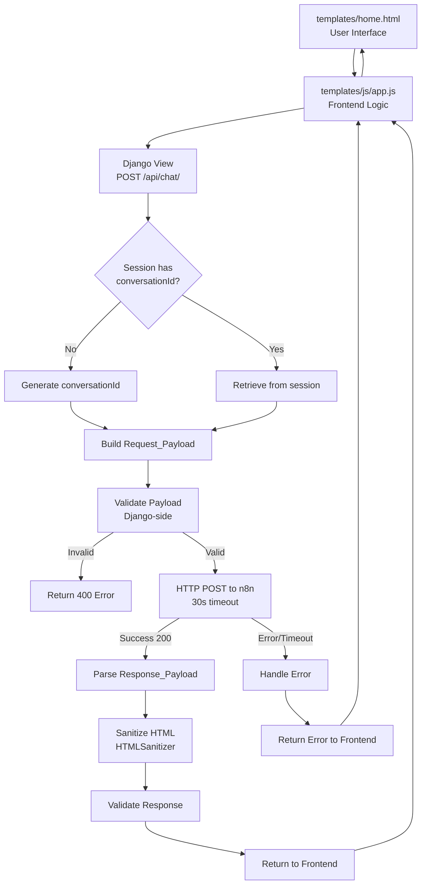
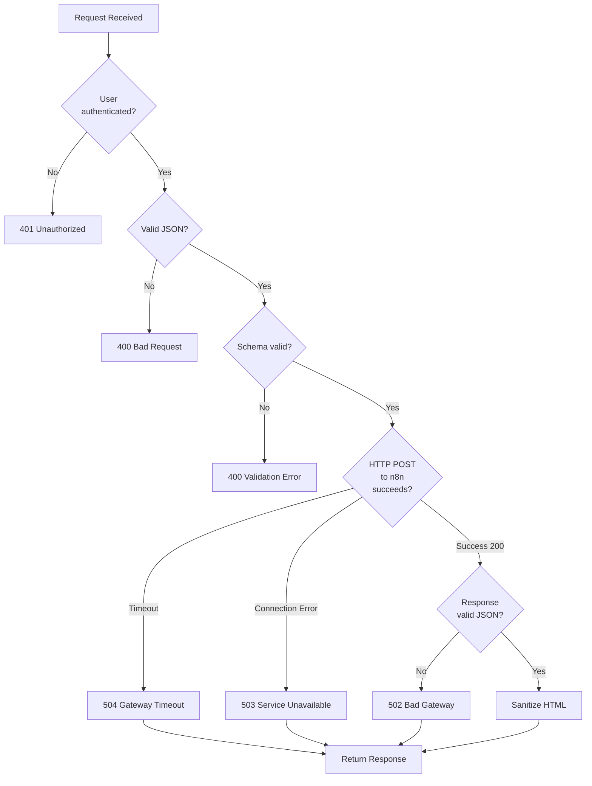

# Design Document: Home Chat Orchestrator Contract

## Overview

Este diseño define la arquitectura técnica del contrato de comunicación entre Django (frontend home/chat) y el orquestador n8n para Personal Stock MVP 1. El contrato establece:

- Schema de entrada (Request_Payload) desde Django hacia n8n
- Schema de salida (Response_Payload) desde n8n hacia Django
- Validación Django-side antes de enviar
- Validación n8n-side al recibir
- Manejo de errores y casos edge
- Generación de ConversationId en Django session
- Construcción del User_Object desde request.user
- Integración con templates/js/app.js

El sistema usa un solo webhook unificado que soporta todos los agentes mediante el campo `agentType` o detección automática de intención por parte del orquestador.

**Stack técnico:**

- Python/Django (backend)
- Templates HTML + vanilla JS (frontend)
- Django REST Framework serializers (validación)
- requests library (HTTP client)
- n8n webhook (orquestador)
- Django session backend (conversationId storage)

**Dependencias de specs:**

- `usuarios-demo-perfiles-permisos`: modelo User con perfil, roles, memoria_habilitada
- `base-django-login-home`: autenticación, sesión, request.user
- `memoria-feedback-correcciones`: fuente efectiva de memoryEnabled (implementación futura)

## Architecture

### High-Level Architecture



````

### Component Architecture

```mermaid
graph LR
    subgraph "Django Backend"
        A[ChatView<br/>POST /api/chat/] --> B[SessionManager<br/>conversationId]
        A --> C[UserObjectBuilder<br/>build_user_object]
        A --> D[PayloadValidator<br/>Django-side]
        A --> E[N8nClient<br/>HTTP requests]
        A --> F[HTMLSanitizer<br/>bleach]
    end

    subgraph "Django Session"
        B --> G[(Session Store<br/>conversationId)]
    end

    subgraph "n8n Orchestrator"
        E --> H[Webhook Endpoint]
        H --> I[Payload Validator<br/>n8n-side]
        I --> J[Agent Router]
        J --> K[Agent Response]
    end

    C --> A
    D --> A
    K --> E
    F --> A
````

````

### Sequence Diagram: Full Request Flow

```mermaid
sequenceDiagram
    participant U as User (Browser)
    participant JS as app.js
    participant V as ChatView
    participant S as Session
    participant B as UserObjectBuilder
    participant Val as PayloadValidator
    participant N as N8nClient
    participant W as n8n Webhook
    participant H as HTMLSanitizer

    U->>JS: Submit message
    JS->>V: POST /api/chat/ {query}
    V->>S: get conversationId
    alt conversationId exists
        S-->>V: return existing ID
    else conversationId missing
        V->>V: generate new ID
        V->>S: save conversationId
    end

    V->>B: build_user_object(request.user)
    B->>B: get userId, userEmail, userName
    B->>B: get profile, roles
    B->>B: get memoryEnabled
    B-->>V: User_Object

    V->>V: construct Request_Payload
    V->>Val: validate(Request_Payload)

    alt validation fails
        Val-->>V: ValidationError
        V-->>JS: 400 {error}
        JS-->>U: Display error
    else validation succeeds
        Val-->>V: OK
        V->>N: send_to_n8n(payload)

        alt n8n request succeeds
            N->>W: POST payload (30s timeout)
            W->>W: validate payload n8n-side
            W->>W: route to agent
            W->>W: execute workflow
            W-->>N: Response_Payload
            N-->>V: Response_Payload
            V->>H: sanitize(output)
            H-->>V: sanitized HTML
        else n8n request fails
            N-->>V: Error (timeout/connection)
            V-->>JS: 503/504 {error}
            JS-->>U: Display error
        end

        V->>V: validate Response_Payload
        V-->>JS: 200 {response}
        JS->>JS: renderAssistantContent(output)
        JS-->>U: Display response
    end
````

````

## Components and Interfaces

### 1. Django View: ChatView

**Location:** `app/core/views.py`

**Responsibilities:**
- Receive user messages from frontend
- Manage conversationId in session
- Build Request_Payload
- Validate Request_Payload Django-side
- Send payload to n8n
- Handle response from n8n
- Return Response_Payload to frontend

**Interface:**

```python
from django.contrib.auth.decorators import login_required
from django.views.decorators.http import require_http_methods
from django.http import JsonResponse
from django.views.decorators.csrf import csrf_protect
import json

@login_required
@require_http_methods(["POST"])
@csrf_protect  # Session-based auth requires CSRF protection with explicit token from frontend
def chat_view(request):
    """
    POST /api/chat/

    Request body (JSON):
    {
        "query": "string",
        "agentType": "auto" | "rag-mails" | "trigger-comunicaciones" (optional)
    }

    Response (JSON):
    {
        "conversationId": "conv-...",
        "output": "string (HTML)",
        "html_render": true,
        "metadata": {
            "agent_used": "string",
            "execution_time_ms": number,
            "records_found": number | null
        }
    }
    or
    {
        "error": "string"
    }
    """
    pass
````

### 2. Session Manager: ConversationIdManager

**Location:** `app/core/helpers/conversation.py`

**Responsibilities:**

- Generate new conversationId with format `conv-<timestamp>-<random>`
- Store conversationId in Django session
- Retrieve conversationId from Django session
- Handle session key lifecycle

**Interface:**

```python
import time
import random
import string

class ConversationIdManager:
    SESSION_KEY = 'conversationId'

    @staticmethod
    def generate_conversation_id() -> str:
        """
        Generate conversationId with format: conv-<timestamp>-<random>
        - timestamp: Unix timestamp in base36
        - random: 6-character alphanumeric string [a-z0-9]

        Example: "conv-1a2b3c4d-e5f6g7"
        """
        timestamp = int(time.time())
        timestamp_b36 = _to_base36(timestamp)
        random_suffix = ''.join(
            random.choices(string.ascii_lowercase + string.digits, k=6)
        )
        return f"conv-{timestamp_b36}-{random_suffix}"

    @classmethod
    def get_or_create(cls, session) -> str:
        """
        Get existing conversationId from session or create new one.
        """
        conversation_id = session.get(cls.SESSION_KEY)
        if not conversation_id:
            conversation_id = cls.generate_conversation_id()
            session[cls.SESSION_KEY] = conversation_id
            session.modified = True
        return conversation_id

    @classmethod
    def reset(cls, session) -> str:
        """
        Reset conversationId (for "Nueva conversación" action).
        """
        conversation_id = cls.generate_conversation_id()
        session[cls.SESSION_KEY] = conversation_id
        session.modified = True
        return conversation_id

def _to_base36(number: int) -> str:
    """Convert integer to base36 string."""
    if number == 0:
        return '0'

    alphabet = string.digits + string.ascii_lowercase
    result = []
    while number:
        number, remainder = divmod(number, 36)
        result.append(alphabet[remainder])
    return ''.join(reversed(result))
```

### 3. User Object Builder: UserObjectBuilder

**Location:** `app/core/helpers/user_object.py`

**Responsibilities:**

- Build User_Object from Django request.user
- Extract userId, userEmail, userName
- Extract profile and roles
- Determine effective memoryEnabled value
- Handle fallbacks (empty first_name → username)

**Interface:**

```python
from typing import TypedDict, List

class UserObject(TypedDict):
    userId: int
    userEmail: str
    userName: str
    profile: str
    roles: List[str]
    memoryEnabled: bool

class UserObjectBuilder:
    @staticmethod
    def build(user) -> UserObject:
        """
        Build User_Object from Django User model.

        Args:
            user: Django User instance (from request.user)

        Returns:
            UserObject with all required fields

        Rules:
        - userId: user.id (integer)
        - userEmail: user.email (USERNAME_FIELD)
        - userName: first_name + " " + last_name, fallback to username
        - profile: user.perfil (one of 5 valid profiles)
        - roles: empty array if not "Usuario IC", otherwise from user.roles
        - memoryEnabled: user.memoria_habilitada (source per spec memoria-feedback-correcciones)
        """
        # userName construction
        full_name = f"{user.first_name} {user.last_name}".strip()
        if not full_name:
            user_name = user.username
        else:
            user_name = full_name

        # roles: empty array unless Usuario IC
        if user.perfil != 'Usuario IC':
            roles_list = []
        else:
            roles_list = list(user.roles.values_list('name', flat=True))

        return UserObject(
            userId=user.id,
            userEmail=user.email,
            userName=user_name,
            profile=user.perfil,
            roles=roles_list,
            memoryEnabled=user.memoria_habilitada
        )
```

### 4. Payload Serializers (Django-side validation)

**Location:** `app/core/serializers/chat_serializers.py`

**Responsibilities:**

- Define Request_Payload schema
- Define Response_Payload schema
- Validate types and required fields Django-side
- Provide validation errors in clear format

**Interface:**

```python
from rest_framework import serializers
from datetime import datetime

class UserObjectSerializer(serializers.Serializer):
    userId = serializers.IntegerField(required=True)
    userEmail = serializers.EmailField(required=True)
    userName = serializers.CharField(required=True, allow_blank=False)
    profile = serializers.ChoiceField(
        choices=['Administrador', 'Usuario IC', 'Heavy user', 'Macro', 'Usuario'],
        required=True
    )
    roles = serializers.ListField(
        child=serializers.CharField(allow_blank=False),
        required=True,
        allow_empty=True
    )
    memoryEnabled = serializers.BooleanField(required=True)

class RequestPayloadSerializer(serializers.Serializer):
    conversationId = serializers.CharField(required=True, allow_blank=False)
    query = serializers.CharField(required=True, allow_blank=False)
    timestamp = serializers.DateTimeField(required=True)
    user = UserObjectSerializer(required=True)
    agentType = serializers.CharField(required=False, default='auto')

    def validate_conversationId(self, value):
        """Validate conversationId format: conv-<timestamp>-<random>"""
        if not value.startswith('conv-'):
            raise serializers.ValidationError(
                "conversationId must start with 'conv-'"
            )
        parts = value.split('-')
        if len(parts) != 3:
            raise serializers.ValidationError(
                "conversationId must have format 'conv-<timestamp>-<random>'"
            )
        return value

    def validate_agentType(self, value):
        """Validate and normalize agentType"""
        valid_agents = ['auto', 'rag-mails', 'trigger-comunicaciones']
        if value not in valid_agents:
            # Invalid agent → fallback to auto
            return 'auto'
        return value

class MetadataSerializer(serializers.Serializer):
    agent_used = serializers.CharField(required=True)
    execution_time_ms = serializers.IntegerField(required=True, min_value=0)
    records_found = serializers.IntegerField(required=False, allow_null=True)

class ResponsePayloadSerializer(serializers.Serializer):
    conversationId = serializers.CharField(required=True)
    output = serializers.CharField(required=True, allow_blank=True)
    html_render = serializers.BooleanField(required=True)
    metadata = MetadataSerializer(required=True)
    error = serializers.CharField(required=False, allow_blank=True)
```

### 5. N8n Client: N8nClient

**Location:** `app/core/clients/n8n_client.py`

**Responsibilities:**

- Send Request_Payload to n8n webhook
- Handle HTTP connection, timeout (30s)
- Parse Response_Payload from n8n
- Handle errors (connection, timeout, invalid response)
- Return errors to ChatView for handling

**Interface:**

```python
import os
import requests
from typing import Dict, Any, Optional
from datetime import datetime

class N8nClientError(Exception):
    """Base exception for N8nClient errors"""
    pass

class N8nConnectionError(N8nClientError):
    """Raised when connection to n8n fails"""
    pass

class N8nTimeoutError(N8nClientError):
    """Raised when request to n8n times out"""
    pass

class N8nInvalidResponseError(N8nClientError):
    """Raised when n8n response is invalid"""
    pass

class N8nClient:
    TIMEOUT = 30  # seconds

    def __init__(self, webhook_url: Optional[str] = None):
        self.webhook_url = webhook_url or os.environ.get('N8N_WEBHOOK_URL')
        if not self.webhook_url:
            raise ValueError('N8N_WEBHOOK_URL not configured')

    def send(self, payload: Dict[str, Any]) -> Dict[str, Any]:
        """
        Send Request_Payload to n8n webhook.

        Args:
            payload: Validated Request_Payload dict

        Returns:
            Response_Payload dict

        Raises:
            N8nConnectionError: Connection failed
            N8nTimeoutError: Request timed out
            N8nInvalidResponseError: Response invalid or non-JSON
        """
        try:
            response = requests.post(
                self.webhook_url,
                json=payload,
                headers={'Content-Type': 'application/json'},
                timeout=self.TIMEOUT
            )

            # Handle non-200 status
            if response.status_code != 200:
                raise N8nConnectionError(
                    f"n8n returned HTTP {response.status_code}: {response.text}"
                )

            # Handle empty body
            if not response.content:
                raise N8nInvalidResponseError("n8n responded 200 but with empty body")

            # Parse JSON
            try:
                response_data = response.json()
            except ValueError as e:
                raise N8nInvalidResponseError(
                    f"Response is not valid JSON: {response.text[:200]}"
                ) from e

            return response_data

        except requests.Timeout as e:
            raise N8nTimeoutError(
                f"Request to n8n timed out after {self.TIMEOUT}s"
            ) from e
        except requests.ConnectionError as e:
            raise N8nConnectionError(
                f"Could not connect to n8n at {self.webhook_url}"
            ) from e
```

### 6. HTML Sanitizer: HTMLSanitizer

**Location:** `app/core/helpers/html_sanitizer.py`

**Responsibilities:**

- Sanitize HTML output from n8n before returning to frontend
- Use bleach library with allow-list approach
- Prevent XSS attacks through untrusted external HTML
- Zero trust external systems (defense in depth)

**Interface:**

```python
import bleach

class HTMLSanitizer:
    """
    Sanitize HTML output from n8n using bleach library.

    Per security best practices: Never trust external systems.
    Django MUST sanitize HTML from n8n before returning to frontend.
    """

    # Allow-list of safe HTML tags
    ALLOWED_TAGS = [
        'p', 'strong', 'em', 'ul', 'ol', 'li', 'a', 'br',
        'h1', 'h2', 'h3', 'h4', 'h5', 'h6', 'span', 'div'
    ]

    # Allow-list of safe attributes per tag
    ALLOWED_ATTRIBUTES = {
        'a': ['href'],
        '*': ['class', 'id']  # Allow class and id on all tags
    }

    @classmethod
    def sanitize(cls, html_string: str) -> str:
        """
        Sanitize HTML string using bleach.

        Args:
            html_string: Raw HTML from n8n

        Returns:
            Sanitized HTML safe for frontend rendering

        Security:
            - Removes all tags not in ALLOWED_TAGS
            - Removes all attributes not in ALLOWED_ATTRIBUTES
            - Restricts href protocols to http, https, mailto (prevents javascript: XSS)
            - Strips script tags, event handlers, and malicious content
        """
        if not html_string:
            return ''

        cleaned = bleach.clean(
            html_string,
            tags=cls.ALLOWED_TAGS,
            attributes=cls.ALLOWED_ATTRIBUTES,
            protocols=['http', 'https', 'mailto'],  # Restrict href protocols
            strip=True  # Remove disallowed tags entirely
        )

        # Additionally clean URLs in href attributes
        cleaned = bleach.linkify(
            cleaned,
            skip_tags=['pre', 'code']  # Don't linkify code blocks
        )

        return cleaned
```

## Data Models

### Request_Payload Schema

```json
{
  "conversationId": "conv-1a2b3c4d-e5f6g7",
  "query": "¿Qué comunicaciones recientes hay sobre beneficios?",
  "timestamp": "2026-04-17T14:32:15.123Z",
  "user": {
    "userId": 42,
    "userEmail": "comustock.ci@gmail.com",
    "userName": "Luciano Zurlo",
    "profile": "Administrador",
    "roles": ["Diseñador", "Desarrollador"],
    "memoryEnabled": true
  },
  "agentType": "auto"
}
```

**Field Descriptions:**

| Field                | Type          | Required | Description                                                                                      |
| -------------------- | ------------- | -------- | ------------------------------------------------------------------------------------------------ |
| `conversationId`     | string        | Yes      | Format: `conv-<timestamp>-<random>`. Generated and stored in Django session.                     |
| `query`              | string        | Yes      | Non-empty user message text.                                                                     |
| `timestamp`          | string        | Yes      | ISO 8601 timestamp when query was created.                                                       |
| `user`               | object        | Yes      | Complete user context object.                                                                    |
| `user.userId`        | number        | Yes      | Django user.id (integer).                                                                        |
| `user.userEmail`     | string        | Yes      | Django user.email (USERNAME_FIELD).                                                              |
| `user.userName`      | string        | Yes      | Display name: first_name + " " + last_name, fallback to username.                                |
| `user.profile`       | string        | Yes      | One of: "Administrador", "Usuario IC", "Heavy user", "Macro", "Usuario".                         |
| `user.roles`         | array[string] | Yes      | Empty array if not "Usuario IC", otherwise role names.                                           |
| `user.memoryEnabled` | boolean       | Yes      | From user.memoria_habilitada (effective source per memoria-feedback-correcciones spec).          |
| `agentType`          | string        | No       | One of: "auto", "rag-mails", "trigger-comunicaciones". Default: "auto". Invalid values → "auto". |

### Response_Payload Schema

```json
{
  "conversationId": "conv-1a2b3c4d-e5f6g7",
  "output": "<p>Encontré 3 comunicaciones recientes sobre beneficios...</p>",
  "html_render": true,
  "metadata": {
    "agent_used": "rag-mails",
    "execution_time_ms": 450,
    "records_found": 3
  }
}
```

**Field Descriptions:**

| Field                        | Type           | Required | Description                                       |
| ---------------------------- | -------------- | -------- | ------------------------------------------------- |
| `conversationId`             | string         | Yes      | Same value from Request_Payload.                  |
| `output`                     | string         | Yes      | Agent response (HTML in MVP 1).                   |
| `html_render`                | boolean        | Yes      | Always `true` in MVP 1.                           |
| `metadata`                   | object         | Yes      | Execution metadata.                               |
| `metadata.agent_used`        | string         | Yes      | Which agent processed the request.                |
| `metadata.execution_time_ms` | number         | Yes      | Execution time in milliseconds.                   |
| `metadata.records_found`     | number or null | No       | Number of records found (null if not applicable). |
| `error`                      | string         | No       | Present only when error occurred.                 |

### Error Response Schema

```json
{
  "error": "Error conectando con n8n: HTTP 500 - Internal Server Error"
}
```

## Validation Strategy

### Django-Side Validation (Before Send)

**Validation Layers:**

1. **Request body parsing**
   - Ensure valid JSON
   - Extract `query` and optional `agentType`

2. **User session validation**
   - User must be authenticated (`@login_required`)
   - User object must be available in `request.user`

3. **Payload construction**
   - Generate or retrieve `conversationId`
   - Build `User_Object` from `request.user`
   - Generate ISO 8601 `timestamp`
   - Construct complete `Request_Payload`

4. **Schema validation (RequestPayloadSerializer)**
   - All required fields present
   - Correct types
   - `conversationId` format: `conv-<timestamp>-<random>`
   - `query` non-empty
   - `user.profile` in valid choices
   - `user.roles` is array (can be empty)
   - `user.memoryEnabled` is boolean
   - `agentType` valid or fallback to "auto"

**Validation Error Response:**

```python
{
    "error": "Validation failed",
    "details": {
        "query": ["This field may not be blank."],
        "user": {
            "profile": ["Invalid profile value."]
        }
    }
}
```

### N8n-Side Validation (On Receive)

**n8n Workflow Validation Node:**

Per requirements Requirement 3, n8n must validate:

1. `conversationId` exists and is non-empty string
2. `query` exists and is non-empty string
3. `user` exists and is object
4. `user.userId` exists and is number
5. `user.userEmail` exists and is non-empty string
6. `user.profile` exists and is one of 5 valid values
7. `user.roles` exists and is array (empty array valid)
8. Each element in `user.roles` is non-empty string
9. `user.memoryEnabled` exists and is boolean

**n8n Validation Error Response:**

```json
{
  "conversationId": "conv-1a2b3c4d-e5f6g7",
  "output": "<p>Error: payload inválido recibido por el orquestador.</p>",
  "html_render": true,
  "metadata": {
    "agent_used": "validator",
    "execution_time_ms": 10,
    "records_found": null
  },
  "error": "Required field missing: user.memoryEnabled"
}
```

## Error Handling

### Error Categories

1. **Client Errors (4xx)**
   - Invalid request body (400)
   - Missing required fields (400)
   - Invalid field types (400)
   - User not authenticated (401)

2. **Server Errors (5xx)**
   - n8n unavailable (503)
   - n8n timeout (504)
   - Internal Django error (500)

3. **n8n Errors**
   - n8n validation failure (returned in response)
   - Agent execution error (returned in response)
   - Workflow error (returned in response)

### Error Handling Flow



````

### Error Messages (User-Facing)

**Connection Errors:**
```python
f"Error conectando con n8n: {error_description}"
````

**Timeout Errors:**

```python
"El sistema tardó demasiado en responder. Por favor, intentá de nuevo."
```

**Validation Errors:**

```python
"Hubo un problema con tu consulta. Por favor, intentá de nuevo."
```

### Error Logging

All errors must be logged with context:

```python
import logging

logger = logging.getLogger(__name__)

# Log with context
logger.error(
    "N8n request failed",
    extra={
        'user_id': request.user.id,
        'conversation_id': conversation_id,
        'query': query[:100],  # First 100 chars
        'error_type': type(e).__name__,
        'error_message': str(e)
    }
)
```

## Testing Strategy

### Unit Tests

**Test Coverage:**

1. **ConversationIdManager**
   - Test ID generation format
   - Test base36 conversion
   - Test random suffix uniqueness
   - Test session storage/retrieval
   - Test reset functionality

2. **UserObjectBuilder**
   - Test with complete user data
   - Test fallback: empty first_name → username
   - Test roles: empty for non-"Usuario IC"
   - Test roles: populated for "Usuario IC"
   - Test all profile types
   - Test memoryEnabled values

3. **RequestPayloadSerializer**
   - Test valid payload passes
   - Test missing required fields fail
   - Test invalid types fail
   - Test conversationId format validation
   - Test agentType fallback to "auto"
   - Test invalid profile value fails

4. **ResponsePayloadSerializer**
   - Test valid response passes
   - Test missing metadata fails
   - Test invalid types fail

5. **N8nClient**
   - Test successful request/response
   - Test timeout handling
   - Test connection error handling
   - Test non-200 status handling
   - Test empty body handling
   - Test invalid JSON handling

6. **HTMLSanitizer**
   - Test safe tags pass through
   - Test unsafe tags removed
   - Test script tags blocked
   - Test attributes filtered correctly
   - Test empty string handling
   - Test XSS attack vectors blocked

### Integration Tests

**Test Scenarios:**

1. **Full request flow**
   - User authenticated
   - POST /api/chat/ with query
   - conversationId generated
   - User_Object built
   - Request_Payload constructed
   - n8n responds
   - HTML sanitized
   - Response returned to frontend

2. **Session persistence**
   - First request generates conversationId
   - Second request reuses same conversationId
   - Reset generates new conversationId

3. **Error scenarios**
   - Unauthenticated user → 401
   - Invalid JSON → 400
   - Missing query → 400
   - n8n timeout → 504 error
   - n8n unavailable → 503 error

### Manual Testing Checklist

- [ ] Login as different user profiles
- [ ] Submit query and verify conversationId in session
- [ ] Submit second query, verify same conversationId
- [ ] Click "Nueva conversación", verify new conversationId
- [ ] Test with n8n running (real webhook)
- [ ] Test with n8n stopped (proper error handling)
- [ ] Verify User_Object contains correct data
- [ ] Verify roles empty for non-"Usuario IC"
- [ ] Verify roles populated for "Usuario IC"
- [ ] Test invalid agentType → fallback to "auto"
- [ ] Verify error messages display correctly
- [ ] Verify HTML output renders correctly

## Frontend Integration (templates/js/app.js)

### Current State

The existing `templates/js/app.js` from cs-chat-rag has a hardcoded "benja" user and sends requests to n8n directly.

### Required Changes

**Replace direct n8n calls with Django endpoint:**

```javascript
// OLD (cs-chat-rag):
const N8N_WEBHOOK_URL = 'http://localhost:5678/webhook/...';
fetch(N8N_WEBHOOK_URL, { ... });

// NEW (Personal Stock):
const CHAT_API_URL = '/api/chat/';
fetch(CHAT_API_URL, { ... });
```

**Remove hardcoded user:**

```javascript
// OLD:
const CHAT_USER_ID = "benja";

// NEW:
// User data comes from Django template context
// No need for hardcoded ID
```

### Frontend Request Format

```javascript
async function sendMessage(query, agentType = "auto") {
  try {
    const response = await fetch("/api/chat/", {
      method: "POST",
      headers: {
        "Content-Type": "application/json",
        "X-CSRFToken": getCsrfToken(), // Django CSRF token
      },
      credentials: "same-origin", // Include session cookie
      body: JSON.stringify({
        query: query,
        agentType: agentType, // optional
      }),
    });

    if (!response.ok) {
      throw new Error(`HTTP ${response.status}`);
    }

    const data = await response.json();

    if (data.error) {
      displayError(data.error);
      return;
    }

    // Render response
    renderAssistantMessage(data.output, data.metadata);

    // Log metadata to console (for debugging and future trazabilidad)
    console.log("Agent metadata:", data.metadata);
  } catch (error) {
    displayError(`Error conectando con el servidor: ${error.message}`);
  }
}
```

### Frontend Response Handling

```javascript
function renderAssistantMessage(output, metadata) {
  // output is HTML (html_render: true in MVP 1)
  const messageDiv = document.createElement("div");
  messageDiv.className = "assistant-message";

  // Use existing renderAssistantContent() from cs-chat-rag
  messageDiv.innerHTML = renderAssistantContent(output);

  // Append to chat
  chatContainer.appendChild(messageDiv);

  // Remove typing indicator
  removeTypingIndicator();

  // Save to conversation history in localStorage
  saveToHistory({
    role: "assistant",
    content: output,
    metadata: metadata,
    timestamp: new Date().toISOString(),
  });
}
```

### CSRF Token Handling

```javascript
function getCsrfToken() {
  // Get CSRF token from cookie (REQUIRED for @csrf_protect)
  const name = "csrftoken";
  const cookies = document.cookie.split(";");
  for (let cookie of cookies) {
    const [key, value] = cookie.trim().split("=");
    if (key === name) {
      return decodeURIComponent(value);
    }
  }
  return "";
}
```

**Note:** X-CSRFToken header is REQUIRED, not optional. Django uses @csrf_protect and will reject requests without valid CSRF token.

### Error Display

```javascript
function displayError(errorMessage) {
  const errorDiv = document.createElement("div");
  errorDiv.className = "assistant-message error-message";
  errorDiv.innerHTML = `
        <p><strong>Error</strong></p>
        <p>${errorMessage}</p>
    `;

  chatContainer.appendChild(errorDiv);
  removeTypingIndicator();

  // Save error to history
  saveToHistory({
    role: "assistant",
    content: errorMessage,
    isError: true,
    timestamp: new Date().toISOString(),
  });
}
```

## Module Structure

### Django App Structure

```
app/
├── core/
│   ├── views.py                          # ChatView
│   ├── urls.py                           # Route: /api/chat/
│   ├── helpers/
│   │   ├── __init__.py
│   │   ├── conversation.py               # ConversationIdManager
│   │   ├── user_object.py                # UserObjectBuilder
│   │   └── html_sanitizer.py             # HTMLSanitizer
│   ├── serializers/
│   │   ├── __init__.py
│   │   └── chat_serializers.py           # Request/Response serializers
│   ├── clients/
│   │   ├── __init__.py
│   │   └── n8n_client.py                 # N8nClient
│   └── contracts/
│       ├── __init__.py
│       └── n8n_user_payload.py           # Type definitions (update existing)
└── tests/
    ├── test_conversation.py              # ConversationIdManager tests
    ├── test_user_object.py               # UserObjectBuilder tests
    ├── test_serializers.py               # Serializer tests
    ├── test_n8n_client.py                # N8nClient tests
    ├── test_html_sanitizer.py            # HTMLSanitizer tests
    └── test_chat_integration.py          # Integration tests
```

### Import Structure

```python
# In views.py
from core.helpers.conversation import ConversationIdManager
from core.helpers.user_object import UserObjectBuilder
from core.helpers.html_sanitizer import HTMLSanitizer
from core.serializers.chat_serializers import (
    RequestPayloadSerializer,
    ResponsePayloadSerializer
)
from core.clients.n8n_client import N8nClient, N8nClientError

# In tests
from django.test import TestCase, Client
from django.contrib.auth import get_user_model
from core.helpers.conversation import ConversationIdManager
# etc.
```

### URL Configuration

```python
# app/core/urls.py
from django.urls import path
from core import views

urlpatterns = [
    path('', views.home_view, name='home'),
    path('login/', views.login_view, name='login'),
    path('logout/', views.logout_view, name='logout'),
    path('api/chat/', views.chat_view, name='chat'),  # NEW
]
```

### Environment Variables

```bash
# .env.example (already exists, verify completeness)
DJANGO_SECRET_KEY=your-secret-key-here
DATABASE_URL=sqlite:///db.sqlite3
N8N_WEBHOOK_URL=http://localhost:5678/webhook/personal-stock-orchestrator
```

## Implementation Notes

### ConversationId Generation

**Format:** `conv-<timestamp>-<random>`

**Example:** `conv-1a2b3c4d-e5f6g7`

**Components:**

- Prefix: `conv-` (constant)
- Timestamp: Unix timestamp in base36 (compact representation)
- Separator: `-`
- Random: 6-character alphanumeric string [a-z0-9]

**Uniqueness:** Combination of timestamp (seconds precision) + random suffix provides sufficient uniqueness for conversational context. Not intended as cryptographically secure UUID.

**Storage:** Django session backend (per base-django-login-home spec). Key: `'conversationId'`.

**Lifecycle:**

- Generated on first chat request in session
- Persisted across requests in same session
- Reset when user clicks "Nueva conversación"
- Lost when session expires (per SESSION_COOKIE_AGE in settings.py)

### User_Object Construction Rules

**userId:**

- Source: `user.id` (Django primary key)
- Type: integer
- Purpose: Numeric identifier for trazabilidad

**userEmail:**

- Source: `user.email` (USERNAME_FIELD)
- Type: string
- Purpose: Authentication identifier

**userName:**

- Source: `user.first_name + " " + user.last_name`
- Fallback: `user.username` if first_name empty
- Type: string
- Purpose: Display name only (NOT identifier)

**profile:**

- Source: `user.perfil`
- Type: string (one of 5 choices)
- Values: "Administrador", "Usuario IC", "Heavy user", "Macro", "Usuario"

**roles:**

- Source: `user.roles.all()` if profile == "Usuario IC", else empty array
- Type: array of strings
- Per usuarios-demo-perfiles-permisos Requirement 4: roles only apply to "Usuario IC"

**memoryEnabled:**

- Source: `user.memoria_habilitada` (current implementation)
- Type: boolean
- Note: spec memoria-feedback-correcciones will define precedence rule (toggle UI vs BD field)
- Current design transports the effective value without defining the business logic

### Django-side vs n8n-side Validation

**Defense in depth:** Both layers validate to catch errors early and prevent invalid data propagation.

**Django validates before send:**

- Fails fast (no HTTP request if payload invalid)
- Clear error messages to frontend
- Reduces n8n load
- Prevents malformed requests

**n8n validates on receive:**

- Protects against direct webhook calls (bypassing Django)
- Ensures contract compliance even if Django validation changes
- Enables independent n8n workflow testing
- Required per Requirement 3

### n8n Unavailable Handling

**When n8n is unavailable:**

- Django returns clear error response (503 Service Unavailable or N8nConnectionError)
- No mock fallback in this spec (per requirements.md Conflict 4)
- Mock implementation is in a DIFFERENT spec if needed for development
- Error is properly logged and traced (per trazabilidad requirements)

**Per requirements.md Conflict 4:** Mock responses are NOT implemented in this spec.

When N8N_WEBHOOK_URL is not configured or n8n is unavailable:

- Django returns a clear error: 503 Service Unavailable
- Error message: "Error conectando con n8n: Could not connect to n8n at {url}"
- No fallback behavior, no mock responses

Mock implementations for local development without n8n are handled in a separate spec (not this one).

**Decision logic:**

```python
def send_to_n8n(payload):
    """Send to n8n and handle errors."""
    try:
        client = N8nClient()
        response_data = client.send(payload)
        return response_data
    except N8nConnectionError as e:
        logger.error(f"n8n unavailable: {e}")
        # Return 503 error to frontend
        raise
    except N8nTimeoutError as e:
        logger.error(f"n8n timeout: {e}")
        # Return 504 error to frontend
        raise
```

### Timeout Configuration

**Request timeout:** 30 seconds (per Requirement 7 AC6)

**Rationale:**

- Balances user experience (not too long) with agent processing time
- Prevents indefinite waiting if n8n hangs
- Allows time for complex agent workflows (RAG search, LLM generation)

**Implementation:**

```python
# In N8nClient
TIMEOUT = 30  # seconds

response = requests.post(
    self.webhook_url,
    json=payload,
    timeout=self.TIMEOUT
)
```

**Frontend handling:**

- Show typing indicator while waiting
- Display timeout error if 30s exceeded
- Allow user to retry

### HTML Rendering in MVP 1

**Contract field:** `html_render: boolean`

**MVP 1 behavior:**

- Always `true`
- `output` field contains sanitized HTML
- Frontend uses existing `renderAssistantContent()` function from cs-chat-rag

**Future evolution:**

- `html_render: false` → render as plain text or Markdown
- Field present now for forward compatibility
- Per Requirement 10: documented as MVP 1 limitation

**Security:**

- Django MUST sanitize HTML output using bleach before returning to frontend
- Never trust external systems (zero trust principle)
- n8n output is treated as untrusted external data
- HTMLSanitizer provides defense in depth even if n8n sanitizes
- Frontend uses DOMPurify as additional layer (already in cs-chat-rag)

**Implementation:**

```python
# After receiving response from n8n and before returning to frontend:
from core.helpers.html_sanitizer import HTMLSanitizer

# Sanitize the output field
response_data['output'] = HTMLSanitizer.sanitize(response_data['output'])

# Then return to frontend
return JsonResponse(response_data)
```

### Dependency on memoria-feedback-correcciones

**Current state:**

- This spec transports `memoryEnabled` value
- Source: `user.memoria_habilitada` (DB field)

**Future state (per memoria-feedback-correcciones spec):**

- Business logic: toggle UI vs BD field precedence
- Implementation: separate component/service provides effective value
- This contract: unchanged, continues to transport the effective value

**Integration point:**

```python
# Current (MVP 1):
memory_enabled = user.memoria_habilitada

# Future (post memoria-feedback-correcciones):
from core.services.memory_service import MemoryService
memory_enabled = MemoryService.get_effective_memory_setting(user, request.session)
```

Contract payload remains identical — only the source of the value changes.

## Security Considerations

### Sensitive Data Exclusion

**Per Requirement 1 AC10:** Request_Payload SHALL NOT include:

- Passwords
- SECRET_KEY
- API keys
- Tokens
- Other secrets

**Implementation:**

- User_Object only includes non-sensitive fields
- No password field in User model serialization
- No SECRET_KEY in payload
- n8n webhook URL in environment variable (not in payload)

### CSRF Protection

**Django view requires CSRF token:**

```python
@csrf_protect
def chat_view(request):
    # Session-based auth requires CSRF protection with explicit token from frontend
    pass
```

**Frontend MUST send X-CSRFToken header:**

- CSRF token is REQUIRED, not optional
- Token obtained from cookie
- Sent in X-CSRFToken header with every POST request

**Rationale:** Using @csrf_protect consistently (NOT @csrf_exempt). Session-based auth requires CSRF protection to prevent CSRF attacks.

### Authentication

**Required:** User must be authenticated (`@login_required`)

**Session-based auth:**

- Session cookie sent with request
- Django validates session
- `request.user` populated with authenticated User

**No API keys in frontend:** All authentication via Django session.

### Input Sanitization

**Django-side:**

- Validate query is string (no injection)
- Validate all fields with serializers
- No SQL injection risk (using ORM)
- **Sanitize HTML from n8n using bleach (defense in depth)**
- **Protocol restriction:** href attributes limited to http, https, mailto (prevents javascript: XSS)

**n8n-side:**

- Sanitize HTML before returning (first line of defense)
- Validate all inputs
- Prevent injection attacks

**Django HTML Sanitization (CRITICAL):**

- **Never trust external systems** for security
- Django MUST sanitize HTML from n8n before returning to frontend
- Use HTMLSanitizer with bleach library
- Allow-list approach: only safe tags and attributes pass through
- Protocol restriction: href protocols limited to http, https, mailto (prevents javascript: XSS)
- Blocks script tags, event handlers, and malicious content

**Frontend:**

- Use DOMPurify for HTML rendering (already in cs-chat-rag)
- Escape user input when displaying
- Third layer of defense

### Rate Limiting (Future)

**Not implemented in MVP 1**, but design supports addition:

```python
from django.views.decorators.ratelimit import ratelimit

@ratelimit(key='user', rate='10/m', method='POST')
def chat_view(request):
    # Limit to 10 requests per minute per user
    pass
```

## Performance Considerations

### ConversationId Generation

**Performance:** O(1), negligible overhead

- Base36 conversion: ~10 arithmetic operations
- Random string: 6 characters, fast
- Session write: depends on session backend (DB write if db backend)

**Optimization:** ConversationId generated once per conversation, not per request.

### User_Object Construction

**Performance:** O(1) + O(roles)

- User fields: direct attribute access
- Roles: single DB query with `values_list()`
- Cached in request lifecycle

**Optimization:** Consider prefetching roles in view:

```python
user = request.user
user = User.objects.prefetch_related('roles').get(pk=user.pk)
```

### Request_Payload Validation

**Performance:** O(fields), fast

- Serializer validation: ~1ms for this payload size
- No DB queries during validation

### HTTP Request to n8n

**Performance:** Depends on n8n processing time

- Network latency: local ~1-5ms, remote ~20-100ms
- n8n processing: 100ms - 10s depending on agent
- Timeout: 30s maximum

**Bottleneck:** n8n agent execution, not Django

**Optimization considerations:**

- Consider async task queue for long-running agents (future)
- WebSocket for real-time streaming (future)
- Caching for repeated queries (future)

### Response Rendering

**Performance:** Frontend-side

- HTML rendering: depends on output size
- DOMPurify sanitization: ~1-10ms
- DOM manipulation: ~1-5ms

**Not a bottleneck** for typical response sizes (<10KB HTML).

### Database Impact

**Queries per request:**

1. Session lookup (if db session backend)
2. User lookup (cached by Django auth)
3. Roles lookup (if "Usuario IC")
4. Session write (if conversationId generated)

**Total:** ~2-4 queries, minimal impact

**Future optimization:** Redis session backend for better performance at scale.

## Future Evolution

### From MVP 1 to MVP 2+

**Potential enhancements:**

1. **Memory Context**
   - Include conversation history in Request_Payload
   - Field: `memory_context: array of messages`
   - Source: UserMemory model (spec memoria-feedback-correcciones)

2. **Streaming Responses**
   - WebSocket connection instead of HTTP POST
   - Real-time token streaming from LLM
   - Frontend updates as response generates

3. **Agent Routing Metadata**
   - Return recommended next actions
   - Return conversation state
   - Return available agent suggestions

4. **Response Formats**
   - Support `html_render: false` (plain text)
   - Support Markdown rendering
   - Support rich media (images, files)

5. **Trazabilidad Integration**
   - Automatic logging to WorkflowRun model
   - Link conversationId to trazabilidad records
   - Integration with acciones-trazabilidad-metricas spec

6. **Advanced Error Recovery**
   - Retry logic with exponential backoff
   - Circuit breaker pattern for n8n
   - Graceful degradation strategies

7. **Caching Layer**
   - Cache repeated queries
   - Cache agent responses
   - TTL-based invalidation

8. **Rate Limiting**
   - Per-user rate limits
   - Per-profile rate limits
   - Throttling for expensive agents

### Breaking Changes to Avoid

**Contract stability:** Once in production, avoid:

- Removing required fields from Request_Payload
- Changing field types
- Renaming fields

**Preferred evolution:**

- Add optional fields
- Add new endpoints for new functionality
- Version the API if breaking changes needed (`/api/v2/chat/`)

## Dependencies and Integration Points

### Upstream Dependencies (Required Before Implementation)

**From usuarios-demo-perfiles-permisos:**

- User model with fields: `id`, `email`, `first_name`, `last_name`, `perfil`, `roles`, `memoria_habilitada`
- Role model with valid role names
- User.perfil choices: Administrador, Usuario IC, Heavy user, Macro, Usuario
- Rule: roles only for "Usuario IC" profile

**From base-django-login-home:**

- Authentication system working
- Session backend configured
- `request.user` populated with authenticated User
- Templates integration: `home.html`, `app.js`
- Static files served correctly

**Status:** Both dependencies are `completed` per personal-stock-mvp-master spec.

### Downstream Consumers (Will Use This Contract)

**Specs that depend on home-chat-orchestrator-contract:**

1. **acciones-trazabilidad-metricas**
   - Logs Request_Payload and Response_Payload
   - Records conversationId for tracing
   - Uses metadata for metrics

2. **rag-mails-dataset-permissions**
   - Receives User_Object for permission filtering
   - Returns Response_Payload with records_found
   - Agent identifier: "rag-mails"

3. **trigger-comunicaciones-email**
   - Receives User_Object for project creation
   - Returns Response_Payload with workflow status
   - Agent identifier: "trigger-comunicaciones"

4. **memoria-feedback-correcciones**
   - Provides effective `memoryEnabled` value
   - Uses conversationId for memory storage
   - Links feedback to specific requests

### Integration with n8n

**n8n Workflow Requirements:**

**Webhook node configuration:**

- Method: POST
- Path: `/webhook/personal-stock-orchestrator`
- Authentication: None (relies on Django auth upstream)
- Response mode: Synchronous (wait for workflow completion)

**Expected n8n workflow structure:**

```
1. Webhook Trigger (receive Request_Payload)
2. Validate Payload Node (per Requirement 3)
3. Extract User & Query
4. Classify Intention (agentType or auto-detect)
5. Route to Agent (switch node)
   - Case "rag-mails": Call RAG workflow
   - Case "trigger-comunicaciones": Call Trigger workflow
   - Default: Call general LLM
6. Format Response_Payload
7. Return Response (200 JSON)
```

**Error handling in n8n:**

- Validation failure → 400 with error in Response_Payload
- Agent execution error → 200 with error field in Response_Payload
- Workflow crash → Django catches timeout/connection error

## Deployment Considerations

### Environment Variables

**Required:**

- `DJANGO_SECRET_KEY`: Django secret key
- `DATABASE_URL`: Database connection string
- `N8N_WEBHOOK_URL`: n8n webhook endpoint

**Optional:**

- `N8N_TIMEOUT`: Override default 30s timeout

**Example .env:**

```bash
DJANGO_SECRET_KEY=your-secret-key-here
DATABASE_URL=sqlite:///db.sqlite3
N8N_WEBHOOK_URL=http://localhost:5678/webhook/personal-stock-orchestrator

# Optional
N8N_TIMEOUT=30
```

### Local Development Setup

**Prerequisites:**

1. Django app running (per base-django-login-home)
2. n8n instance running (REQUIRED for testing webhook flow)
3. Demo users loaded (per usuarios-demo-perfiles-permisos)

**Steps:**

```bash
# 1. Set environment variables
cp .env.example .env
# Edit .env with your values

# 2. Run migrations
cd app
python manage.py migrate

# 3. Load demo users
python manage.py load_demo_users

# 4. Start Django server
python manage.py runserver

# 5. (Optional) Start n8n
# In separate terminal:
n8n start

# 6. Import n8n workflow
# Import workflow from mails/workflows-n8n/personal-stock-orchestrator.json
```

### n8n Setup

**Create webhook workflow:**

1. Open n8n (`http://localhost:5678`)
2. Create new workflow: "Personal Stock Orchestrator"
3. Add Webhook node:
   - Method: POST
   - Path: `personal-stock-orchestrator`
   - Response mode: "When Last Node Finishes"
4. Add validation node (Function node with validation logic)
5. Add routing logic (Switch node on `agentType`)
6. Activate workflow
7. Copy webhook URL to `.env`

### Production Considerations (Future)

**Not implemented in MVP 1**, but considerations:

1. **Scale:**
   - Load balancer for multiple Django instances
   - n8n cluster or queue-based architecture
   - Redis for session backend (instead of DB)

2. **Security:**
   - HTTPS for all endpoints
   - n8n webhook authentication
   - Rate limiting
   - Input sanitization

3. **Monitoring:**
   - Request/response logging
   - Error tracking (Sentry)
   - Performance monitoring (New Relic, Datadog)
   - n8n workflow monitoring

4. **Reliability:**
   - Retry logic for n8n requests
   - Circuit breaker for failed agents
   - Graceful degradation
   - Health check endpoints

## Open Questions and Decisions

### Resolved Decisions

**1. USERNAME_FIELD is email (Conflict 1 from requirements.md)**

- Decision: Use `userEmail` (authentication), `userId` (trazabilidad), `userName` (display)
- Rationale: Clear separation of concerns, follows Django best practices

**2. Django-side validation (Conflict 2 from requirements.md)**

- Decision: Validate in Django before sending to n8n
- Rationale: Fail fast, clear errors, reduce n8n load

**3. Memory transport (Conflict 3 from requirements.md)**

- Decision: Transport effective value, don't define business logic
- Rationale: Separation of concerns, dependency on memoria-feedback-correcciones spec

**4. Unified contract (Conflict 4 from requirements.md)**

- Decision: Single webhook for all agents
- Rationale: Simpler integration, consistent contract, flexible routing

**5. html_render in MVP 1 (Conflict 5 from requirements.md)**

- Decision: Always `true` in MVP 1, field present for future compatibility
- Rationale: MVP scope constraint, forward compatibility

**6. Complete User_Object (Conflict 6 from requirements.md)**

- Decision: Django sends complete user context
- Rationale: n8n doesn't need Django DB access, better security

### Open Questions

**None at this stage.** All requirements clarified during requirements phase.

### Assumptions

1. **Session backend:** Assumes Django session backend configured (per base-django-login-home)
2. **n8n availability:** When n8n unavailable, returns proper error (503 Service Unavailable) - no mock fallback in this spec
3. **User authentication:** Assumes user is always authenticated when accessing /api/chat/
4. **Profile values:** Assumes exactly 5 profiles as defined in usuarios-demo-perfiles-permisos
5. **Role applicability:** Assumes roles only apply to "Usuario IC" profile
6. **HTML safety:** Django sanitizes HTML from n8n as defense in depth (zero trust external systems)

### Constraints

1. **MVP 1 scope:** Only HTML responses (`html_render: true`)
2. **Local deployment:** Not optimized for 20,000 users
3. **Synchronous:** No streaming or async processing
4. **No caching:** Every request hits n8n
5. **No rate limiting:** No protection against abuse (add in future MVP)

## Appendix

### Complete ChatView Implementation Outline

```python
import json
import logging
from datetime import datetime
from django.contrib.auth.decorators import login_required
from django.views.decorators.http import require_http_methods
from django.http import JsonResponse
from django.views.decorators.csrf import csrf_protect

from core.helpers.conversation import ConversationIdManager
from core.helpers.user_object import UserObjectBuilder
from core.helpers.html_sanitizer import HTMLSanitizer
from core.serializers.chat_serializers import (
    RequestPayloadSerializer,
    ResponsePayloadSerializer
)
from core.clients.n8n_client import (
    N8nClient,
    N8nClientError,
    N8nConnectionError,
    N8nTimeoutError,
    N8nInvalidResponseError
)

logger = logging.getLogger(__name__)

@login_required
@require_http_methods(["POST"])
@csrf_protect  # Session-based auth requires CSRF protection with explicit token from frontend
def chat_view(request):
    """
    Handle chat messages from frontend.

    POST /api/chat/
    Body: {"query": "string", "agentType": "auto|rag-mails|trigger-comunicaciones"}

    Returns: Response_Payload or {"error": "string"}
    """
    try:
        # 1. Parse request body
        try:
            body = json.loads(request.body)
        except json.JSONDecodeError:
            return JsonResponse({'error': 'Invalid JSON'}, status=400)

        query = body.get('query', '').strip()
        agent_type = body.get('agentType', 'auto')

        if not query:
            return JsonResponse({'error': 'Query is required'}, status=400)

        # 2. Get or create conversationId
        conversation_id = ConversationIdManager.get_or_create(request.session)

        # 3. Build User_Object
        user_object = UserObjectBuilder.build(request.user)

        # 4. Construct Request_Payload
        request_payload = {
            'conversationId': conversation_id,
            'query': query,
            'timestamp': datetime.utcnow().isoformat() + 'Z',
            'user': user_object,
            'agentType': agent_type
        }

        # 5. Validate Request_Payload
        serializer = RequestPayloadSerializer(data=request_payload)
        if not serializer.is_valid():
            logger.error(f"Payload validation failed: {serializer.errors}")
            return JsonResponse({
                'error': 'Validation failed',
                'details': serializer.errors
            }, status=400)

        validated_payload = serializer.validated_data

        # 6. Send to n8n
        try:
            client = N8nClient()
            response_data = client.send(validated_payload)
        except N8nTimeoutError as e:
            logger.error(f"n8n timeout: {e}")
            return JsonResponse({
                'error': 'El sistema tardó demasiado en responder. Por favor, intentá de nuevo.'
            }, status=504)
        except N8nInvalidResponseError as e:
            logger.error(f"n8n invalid response: {e}")
            return JsonResponse({
                'error': f'Error procesando respuesta de n8n: {str(e)}'
            }, status=502)
        except (ValueError, N8nConnectionError) as e:
            # n8n unavailable - return clear error (NO mock fallback per Conflict 4)
            logger.error(f"n8n unavailable: {e}")
            return JsonResponse({
                'error': f'Error conectando con n8n: {str(e)}'
            }, status=503)
        except N8nClientError as e:
            logger.error(f"n8n client error: {e}")
            return JsonResponse({
                'error': f'Error conectando con n8n: {str(e)}'
            }, status=503)

        # 7. Sanitize HTML output (CRITICAL: defense in depth, zero trust external systems)
        response_data['output'] = HTMLSanitizer.sanitize(response_data['output'])

        # 8. Validate Response_Payload
        response_serializer = ResponsePayloadSerializer(data=response_data)
        if not response_serializer.is_valid():
            logger.error(f"Response validation failed: {response_serializer.errors}")
            return JsonResponse({
                'error': 'Invalid response from orchestrator'
            }, status=502)

        # 9. Return Response_Payload
        return JsonResponse(response_serializer.validated_data, status=200)

    except Exception as e:
        logger.exception("Unexpected error in chat_view")
        return JsonResponse({
            'error': 'Error interno del servidor'
        }, status=500)
```

### Example Test Case

```python
from django.test import TestCase, Client
from django.contrib.auth import get_user_model
from core.helpers.conversation import ConversationIdManager

User = get_user_model()

class ChatViewTest(TestCase):
    def setUp(self):
        self.client = Client()
        self.user = User.objects.create_user(
            email='test@example.com',
            password='testpass123',
            first_name='Test',
            last_name='User',
            perfil='Administrador'
        )
        self.client.login(username='test@example.com', password='testpass123')

    def test_chat_view_generates_conversation_id(self):
        """Test that conversationId is generated and stored in session"""
        response = self.client.post('/api/chat/',
            data={'query': 'Hello'},
            content_type='application/json'
        )

        self.assertEqual(response.status_code, 200)

        # Check session has conversationId
        session = self.client.session
        self.assertIn('conversationId', session)

        # Verify format
        conv_id = session['conversationId']
        self.assertTrue(conv_id.startswith('conv-'))
        parts = conv_id.split('-')
        self.assertEqual(len(parts), 3)

    def test_chat_view_reuses_conversation_id(self):
        """Test that subsequent requests reuse same conversationId"""
        # First request
        response1 = self.client.post('/api/chat/',
            data={'query': 'First message'},
            content_type='application/json'
        )
        conv_id_1 = response1.json()['conversationId']

        # Second request
        response2 = self.client.post('/api/chat/',
            data={'query': 'Second message'},
            content_type='application/json'
        )
        conv_id_2 = response2.json()['conversationId']

        # Should be same
        self.assertEqual(conv_id_1, conv_id_2)

    def test_chat_view_requires_authentication(self):
        """Test that unauthenticated requests are rejected"""
        self.client.logout()

        response = self.client.post('/api/chat/',
            data={'query': 'Hello'},
            content_type='application/json'
        )

        # Should redirect to login
        self.assertEqual(response.status_code, 302)

    def test_chat_view_validates_empty_query(self):
        """Test that empty queries are rejected"""
        response = self.client.post('/api/chat/',
            data={'query': ''},
            content_type='application/json'
        )

        self.assertEqual(response.status_code, 400)
        self.assertIn('error', response.json())
```

---

**End of Design Document**
