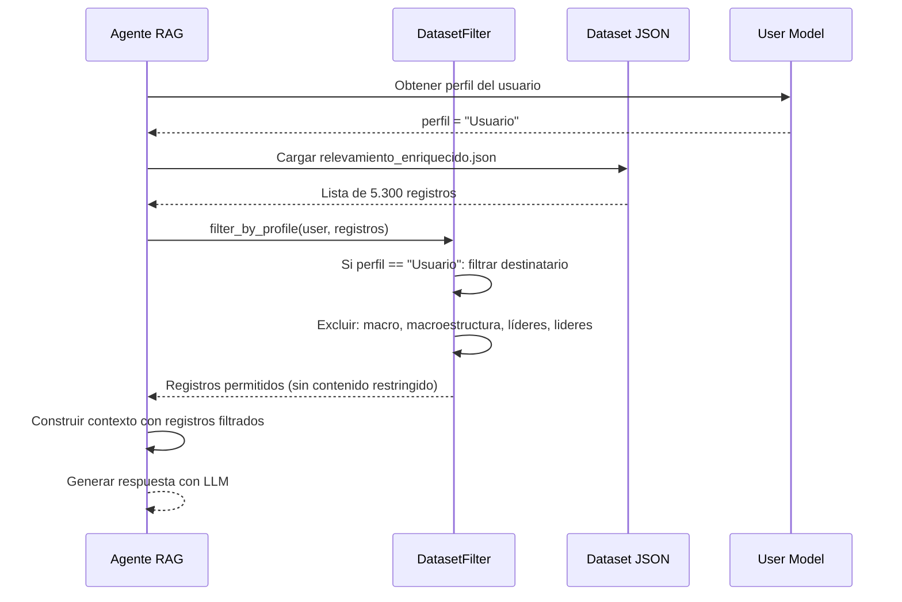
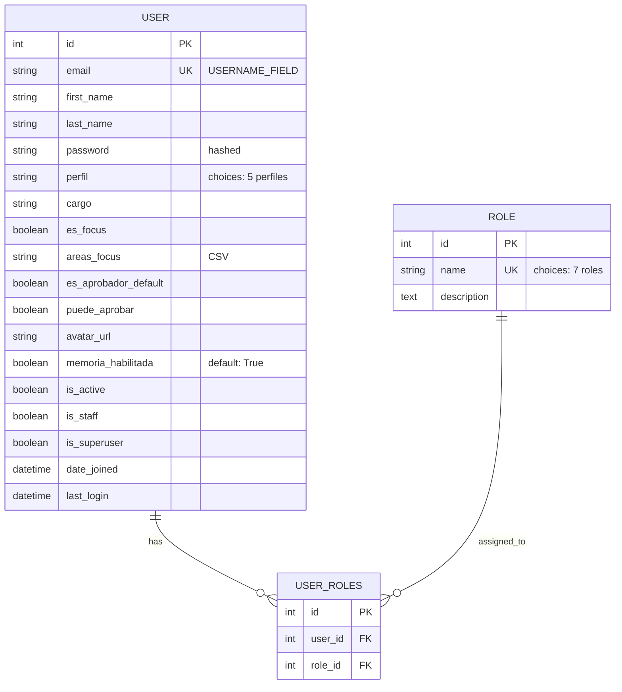

# Design Document

## Introduction

Este documento describe el diseño técnico detallado para el spec `usuarios-demo-perfiles-permisos`, que implementa el sistema completo de usuarios demo, perfiles, roles y filtrado de dataset histórico para Personal Stock MVP 1.

**Resolución del Conflicto 1 (Ubicación del Proyecto Django):**

Tras inspeccionar `cs-chat-rag`, se confirma que es un proyecto independiente basado en:

- Frontend: HTML + CSS + JavaScript vanilla
- Backend: n8n (orquestación de workflows)
- Persistencia: PostgreSQL 16 (solo memoria conversacional)
- Servidor web: nginx (Docker)

**NO existe una base Django en cs-chat-rag.** Es un proyecto completamente distinto arquitecturalmente.

**Decisión de diseño:** El sistema de usuarios, perfiles y permisos se implementará **extendiendo la base Django ya creada en `./app`** por el spec `base-django-login-home`. No se reutiliza nada de cs-chat-rag excepto:

- Inspiración visual de la interfaz (ya migrada a `./templates`)
- El esquema PostgreSQL de memoria conversacional (para spec futuro)
- El patrón de orquestación n8n (para spec `home-chat-orchestrator-contract`)

**Alcance de este spec:**

- Extender modelo User de Django con campos de negocio (perfil, roles, cargo, áreas, etc.)
- Crear base demo de 100 usuarios (12 específicos + 88 ficticios)
- Implementar 5 perfiles con permisos diferenciados
- Asignar roles a usuarios del perfil Usuario IC
- Implementar filtro de dataset histórico por perfil (clase Python reutilizable)
- Generar fixture o comando de management para carga inicial
- Exponer perfil y roles al sistema de autenticación y orquestador n8n

**Fuera de alcance:**

- Integración con n8n (spec `home-chat-orchestrator-contract`)
- Implementación del agente RAG que consume el filtro (spec `agente-rag-historial-mails`)
- Trazabilidad de permisos (spec `acciones-trazabilidad-metricas`)

---

## Overview

### Arquitectura del Sistema de Usuarios

```
┌─────────────────────────────────────────────────────────────────┐
│                        Browser (Usuario)                        │
└──────────────────────────┬──────────────────────────────────────┘
                           │ HTTPS
```

                           ▼

┌─────────────────────────────────────────────────────────────────┐
│ Django Application │
│ ┌───────────────────────────────────────────────────────────┐ │
│ │ Custom User Model (AbstractUser) │ │
│ │ - email (unique, username) │ │
│ │ - perfil (Administrador, Usuario IC, Heavy, Macro, User) │ │
│ │ - roles (ManyToMany → Role) │ │
│ │ - cargo, áreas, es_focus, puede_aprobar, etc. │ │
│ └───────────────────────────────────────────────────────────┘ │
│ ┌───────────────────────────────────────────────────────────┐ │
│ │ Dataset Filter (Python Class) │ │
│ │ - filter_by_profile(user, dataset) │ │
│ │ - Filtra registros con destinatario restringido │ │
│ │ - Aplica antes de construir contexto RAG │ │
│ └───────────────────────────────────────────────────────────┘ │
│ ┌───────────────────────────────────────────────────────────┐ │
│ │ Management Command: load_demo_users │ │
│ │ - Lee CSV/fixture con 100 usuarios │ │
│ │ - Valida 12 usuarios específicos │ │
│ │ - Crea usuarios + roles en base de datos │ │
│ └───────────────────────────────────────────────────────────┘ │
└──────────────────────────┬──────────────────────────────────────┘
│
▼
┌───────────────┐
│ SQLite DB │
│ - auth_user │
│ - core_role │
│ - user_roles │
└───────────────┘

````

### Flujo de Filtrado de Dataset



### Estructura de Carpetas (Actualizada)

```

~/Desktop/PS-edit/
app/
manage.py
config/
settings.py # ← MODIFICADO: AUTH_USER_MODEL
core/
models.py # ← NUEVO: User, Role, Profile choices
permissions.py # ← NUEVO: DatasetFilter clase
management/
commands/
load_demo_users.py # ← NUEVO: Comando de carga
migrations/
0001_initial.py # ← GENERADO: Migración User + Role
tests/
test_permissions.py # ← NUEVO: Tests de filtro
test_users.py # ← NUEVO: Tests de usuarios
fixtures/
demo_users.json # ← NUEVO: 100 usuarios (fixture)
db.sqlite3
mails/
output/
relevamiento_enriquecido.json # ← CONSUMIDO por DatasetFilter
templates/
home.html # ← MODIFICADO: Mostrar perfil/roles

```

---

## Architecture

### Custom User Model Design

```

**Decisión:** Extender `AbstractUser` en lugar de usar modelo User estándar.

**Justificación:**

- Permite agregar campos custom sin crear tabla adicional
- Mantiene compatibilidad con sistema de autenticación Django
- Facilita integración con admin panel y permisos Django
- Es la práctica recomendada por Django docs

**Trade-offs:**

- Requiere migración inicial antes de crear cualquier User
- No puede cambiar a otro modelo User después sin migración compleja
- **IMPORTANTE:** Este spec corre **después** del spec `base-django-login-home`, lo que significa que ya existe un superusuario creado (tarea 9 del spec 1). La migración a AbstractUser requiere:
  1. Respaldar datos del superusuario existente (email, password hash)
  2. Aplicar migración que reemplaza tabla `auth_user` por `core_user`
  3. Recrear superusuario con `createsuperuser` o migración de datos
  4. Validar que el superusuario puede autenticarse correctamente

**core/models.py:**

```python
from django.contrib.auth.models import AbstractUser
from django.db import models

class User(AbstractUser):
    """
    Custom User model para Personal Stock.
    Extiende AbstractUser para agregar campos de negocio.
    """

    # Perfil del usuario (choices)
    class Profile(models.TextChoices):
```

        ADMINISTRADOR = 'Administrador', 'Administrador'
        USUARIO_IC = 'Usuario IC', 'Usuario IC'
        HEAVY_USER = 'Heavy user', 'Heavy user'
        MACRO = 'Macro', 'Macro'
        USUARIO = 'Usuario', 'Usuario'

    # Campos obligatorios del brief
    email = models.EmailField(unique=True, verbose_name='Email')
    perfil = models.CharField(
        max_length=20,
        choices=Profile.choices,
        default=Profile.USUARIO,
        verbose_name='Perfil'
    )
    roles = models.ManyToManyField(
        'Role',
        blank=True,
        related_name='users',
        verbose_name='Roles'
    )
    cargo = models.CharField(max_length=100, blank=True, verbose_name='Cargo')

    # Campos de categorización
    es_focus = models.BooleanField(default=False, verbose_name='Es Focus')
    areas_focus = models.CharField(
        max_length=200,
        blank=True,
        verbose_name='Áreas Focus',
        help_text='Áreas separadas por coma'
    )

    # Campos de permisos de aprobación
    es_aprobador_default = models.BooleanField(
        default=False,
        verbose_name='Es aprobador por defecto'
    )
    puede_aprobar = models.BooleanField(
        default=False,
        verbose_name='Puede aprobar comunicaciones'
    )

    # Avatar y memoria
    avatar_url = models.URLField(
        blank=True,
        verbose_name='URL del avatar',
        help_text='URL externa o path relativo a static'
    )
    memoria_habilitada = models.BooleanField(
        default=True,
        verbose_name='Memoria conversacional habilitada'
    )
    # Configurar email como username
    USERNAME_FIELD = 'email'
    REQUIRED_FIELDS = ['first_name', 'last_name']

    class Meta:
        verbose_name = 'Usuario'
        verbose_name_plural = 'Usuarios'
        ordering = ['last_name', 'first_name']

    def __str__(self):
        return f"{self.first_name} {self.last_name} ({self.email})"

    def get_full_name(self):
        return f"{self.first_name} {self.last_name}".strip()

    def get_short_name(self):
        return self.first_name

    def has_restricted_access(self):
        """Retorna True si el usuario tiene acceso restringido al dataset."""
        return self.perfil == self.Profile.USUARIO

    def can_access_restricted_content(self):
        """Retorna True si el usuario puede acceder a contenido restringido."""
        return self.perfil in [
            self.Profile.ADMINISTRADOR,
            self.Profile.USUARIO_IC,
            self.Profile.HEAVY_USER,
            self.Profile.MACRO,
        ]

class Role(models.Model):
"""
Roles asignables a usuarios con perfil Usuario IC.
"""
class RoleName(models.TextChoices):
DISENADOR = 'Diseñador', 'Diseñador'
DESARROLLADOR = 'Desarrollador', 'Desarrollador'
REDACTOR = 'Redactor', 'Redactor'
PRODUCTOR = 'Productor', 'Productor'
GERENTE_CULTURA = 'Gerente Cultura', 'Gerente Cultura'
GERENTE_IC = 'Gerente IC', 'Gerente IC'
ESPECIALISTA = 'Especialista', 'Especialista'

    name = models.CharField(
        max_length=20,
        choices=RoleName.choices,
        unique=True,
        verbose_name='Nombre del rol'
    )

    description = models.TextField(
        blank=True,
        verbose_name='Descripción del rol'
    )

    class Meta:
        verbose_name = 'Rol'
        verbose_name_plural = 'Roles'
        ordering = ['name']

    def __str__(self):
        return self.name

````

**Campos heredados de AbstractUser (ya disponibles):**
- `username`: CharField (no usado, email es USERNAME_FIELD)
- `password`: CharField (hasheado)
- `first_name`: CharField
- `last_name`: CharField
- `is_active`: BooleanField
- `is_staff`: BooleanField
- `is_superuser`: BooleanField
- `date_joined`: DateTimeField
- `last_login`: DateTimeField

**Configuración en settings.py:**

```python
# config/settings.py

AUTH_USER_MODEL = 'core.User'
````

---

## Components and Interfaces

### 1. DatasetFilter Class

**Ubicación:** `app/core/permissions.py`

**Responsabilidad:** Filtrar registros del dataset histórico según el perfil del usuario, aplicando restricciones de destinatario antes de construir el contexto RAG.

**Interfaz pública:**

```python
class DatasetFilter:
    """
    Filtra registros del dataset histórico según permisos de perfil.

    Regla: Perfil "Usuario" NO puede acceder a comunicaciones dirigidas a:
    - macro (case-insensitive)
    - macroestructura (case-insensitive)
    - líderes / lideres (case-insensitive)
    """

    # Substrings restringidas para perfil Usuario
    RESTRICTED_SUBSTRINGS = ['macro', 'macroestructura', 'líderes', 'lideres']

    @classmethod
    def filter_by_profile(cls, user, dataset_records: list) -> list:
        """
        Filtra registros según perfil del usuario.

        Args:
            user: Instancia de User model
            dataset_records: Lista de diccionarios del dataset
```

        Returns:
            Lista filtrada de registros (excluye contenido restringido)

        Raises:
            ValueError: Si user no tiene perfil válido
        """
        if not user or not user.perfil:
            raise ValueError("Usuario sin perfil definido")

        # Perfiles privilegiados ven todo
        if user.can_access_restricted_content():
            return dataset_records

        # Perfil Usuario: filtrar por destinatario
        filtered = []
        for record in dataset_records:
            destinatario = record.get('destinatario', '').lower()

            # Excluir si contiene substring restringida
            is_restricted = any(
                substring in destinatario
                for substring in cls.RESTRICTED_SUBSTRINGS
            )

            if not is_restricted:
                filtered.append(record)

        return filtered

    @classmethod
    def is_record_restricted(cls, record: dict, user) -> bool:
        """
        Verifica si un registro específico está restringido para el usuario.

        Args:
            record: Diccionario con campo 'destinatario'
            user: Instancia de User model

        Returns:
            True si el registro está restringido para este usuario
        """
        if user.can_access_restricted_content():
            return False

        destinatario = record.get('destinatario', '').lower()
        return any(
            substring in destinatario
            for substring in cls.RESTRICTED_SUBSTRINGS
        )

````

**Ejemplo de uso:**

```python
from core.permissions import DatasetFilter
import json

# Cargar dataset
with open('mails/output/relevamiento_enriquecido.json', 'r') as f:
    all_records = json.load(f)

# Filtrar por usuario
filtered_records = DatasetFilter.filter_by_profile(
    user=request.user,
    dataset_records=all_records
)

# filtered_records contiene solo registros permitidos para el usuario
````

### 2. Management Command: load_demo_users

**Ubicación:** `app/core/management/commands/load_demo_users.py`

**Responsabilidad:** Cargar 100 usuarios demo desde CSV o fixture JSON, validando que incluye los 12 usuarios específicos requeridos.

**Interfaz de comando:**

```bash
# Cargar desde fixture JSON (recomendado)
python manage.py load_demo_users --fixture fixtures/demo_users.json

# Cargar desde CSV
python manage.py load_demo_users --csv path/to/usuarios_demo.csv

# Validar sin cargar
python manage.py load_demo_users --fixture fixtures/demo_users.json --dry-run
```

**Validaciones obligatorias:**

1. Total de usuarios = 100
2. Presencia de los 12 usuarios específicos con email correcto
3. Campos obligatorios presentes: first_name, last_name, email, perfil
4. Email único por usuario
5. Perfil válido (uno de los 5)
6. Roles válidos si perfil == Usuario IC
7. Roles vacíos si perfil != Usuario IC

**Manejo de errores:**

- Si faltan campos obligatorios: rechazar carga completa, listar campos faltantes
- Si email duplicado: rechazar carga completa, listar duplicados
- Si faltan usuarios específicos: rechazar carga completa, listar faltantes
- Si total != 100: rechazar carga completa, mostrar total detectado

**Estructura del CSV esperado:**

```csv
first_name,last_name,email,perfil,roles,cargo,es_focus,areas_focus,es_aprobador_default,puede_aprobar,avatar_url,memoria_habilitada
Luciano,Zurlo,comustock.ci@gmail.com,Administrador,"Diseñador;Desarrollador",Diseñador,true,"Diseño;Desarrollo",false,true,,true
Diego,Ferrari,comustock.uci1@gmail.com,Usuario IC,Redactor,Redactor,true,Comunicación Interna,false,false,,true
...
```

**Notas:**

- Roles separados por punto y coma (;) si son múltiples
- Campos booleanos: true/false o 1/0
- Campos vacíos permitidos para opcionales

### 3. Fixture JSON

**Ubicación:** `app/fixtures/demo_users.json`

**Formato:** Django fixture estándar

```json
[
    {
        "model": "core.user",
        "pk": 1,
        "fields": {
            "email": "comustock.ci@gmail.com",
            "first_name": "Luciano",
            "last_name": "Zurlo",
            "perfil": "Administrador",
            "cargo": "Diseñador",
            "es_focus": true,
            "areas_focus": "Diseño;Desarrollo",
            "puede_aprobar": true,
            "memoria_habilitada": true,
            "is_active": true,
            "is_staff": true
        }
    },
    ...
]
```

**Nota:** Los roles se asignan en un fixture separado `demo_roles.json` o mediante señales post_save.

---

## Data Models

### Database Schema



### Field Constraints

**User.email:**

- UNIQUE constraint (username field)
- NOT NULL
- Max length: 254 chars (email estándar)

**User.perfil:**

- CHOICES constraint (5 opciones)
- NOT NULL (default: 'Usuario')

**User.roles:**

- ManyToMany relationship
- Tabla intermedia: `core_user_roles`
- Constraint: Solo usuarios con perfil "Usuario IC" pueden tener roles

**Role.name:**

- UNIQUE constraint
- CHOICES constraint (7 opciones)
- NOT NULL

### Indexes

```python
class User(AbstractUser):
    class Meta:
        indexes = [
            models.Index(fields=['email']),  # Ya incluido por unique=True
            models.Index(fields=['perfil']),  # Consultas frecuentes por perfil
            models.Index(fields=['es_focus']),  # Filtro común
        ]
```

---

## Correctness Properties

**Nota sobre PBT para este feature:**

Este spec implementa principalmente CRUD de usuarios y permisos de acceso, que son más apropiados para **unit tests** y **integration tests** que para property-based testing puro. Sin embargo, existen algunas propiedades universales testables:

### Property 1: Email Uniqueness

_Para cualquier_ conjunto de usuarios creados en el sistema, todos los emails deben ser únicos (no puede haber duplicados).

**Validates: Requirements 1.6, 8.2**

### Property 2: Profile Assignment Persistence

_Para cualquier_ usuario creado con un perfil válido, al guardarlo y recargarlo desde la base de datos, el perfil debe persistir correctamente sin cambios.

**Validates: Requirements 3.2, 3.3**

### Property 3: Role Assignment for Usuario IC

_Para cualquier_ usuario con perfil "Usuario IC", debe permitir asignar cero o más roles del conjunto válido {Diseñador, Desarrollador, Redactor, Productor, Gerente Cultura, Gerente IC, Especialista}, y todos los roles asignados deben persistir correctamente.

**Validates: Requirements 4.1, 4.3, 4.4**

### Property 4: Role Restriction for Non-Usuario IC

_Para cualquier_ usuario con perfil diferente de "Usuario IC" (Administrador, Heavy user, Macro, Usuario), ese usuario no debe tener ningún rol asignado (roles.count() == 0).

**Validates: Requirements 4.2**

### Property 5: Dataset Filtering by Restricted Substrings

_Para cualquier_ registro del dataset con campo `destinatario` que contenga las substrings "macro", "macroestructura", "líderes" o "lideres" (case-insensitive), y para cualquier usuario con perfil "Usuario", el filtro `DatasetFilter.filter_by_profile()` debe excluir ese registro del resultado.

**Validates: Requirements 5.1, 5.2, 5.3, 5.4, 5.5**

### Property 6: Dataset Access for Privileged Profiles

_Para cualquier_ registro del dataset (incluyendo aquellos con destinatarios restringidos), y para cualquier usuario con perfil en {Administrador, Usuario IC, Heavy user, Macro}, el filtro `DatasetFilter.filter_by_profile()` debe incluir ese registro en el resultado (no aplica restricciones de destinatario).

**Validates: Requirements 5.7**

### Property 7: Profile Validation

_Para cualquier_ intento de crear un usuario con un perfil inválido (no pertenece al conjunto {Administrador, Usuario IC, Heavy user, Macro, Usuario}), Django debe rechazar la operación con un ValidationError.

**Validates: Requirements 8.3**

### Property 8: Invalid Role Assignment Rejection

_Para cualquier_ intento de asignar un rol inválido (no pertenece al conjunto de 7 roles válidos) a un usuario con perfil Usuario IC, Django debe rechazar la operación con un ValidationError.

**Validates: Requirements 8.4**

### Property 9: CSV Load Rejection on Missing Fields

_Para cualquier_ archivo CSV con uno o más registros que tengan campos obligatorios faltantes (first_name, last_name, email, perfil), el comando `load_demo_users` debe rechazar la carga completa y reportar error descriptivo.

**Validates: Requirements 7.5**

---

## Error Handling

### User Creation Errors

**Error:** Email duplicado

- **Django constraint:** IntegrityError on save()
- **User message:** "Ya existe un usuario con este email"
- **HTTP status:** 400 Bad Request
- **Recovery:** Usuario debe usar otro email

**Error:** Perfil inválido

- **Django constraint:** ValidationError on clean()
- **User message:** "Perfil inválido. Opciones: Administrador, Usuario IC, Heavy user, Macro, Usuario"
- **HTTP status:** 400 Bad Request
- **Recovery:** Usuario debe seleccionar perfil válido

**Error:** Rol asignado a no-Usuario IC

- **Django constraint:** ValidationError on save()
- **User message:** "Solo usuarios con perfil 'Usuario IC' pueden tener roles asignados"
- **HTTP status:** 400 Bad Request
- **Recovery:** Cambiar perfil a Usuario IC o remover roles

### Dataset Filter Errors

**Error:** Usuario sin perfil definido

- **Exception:** ValueError
- **Message:** "Usuario sin perfil definido"
- **Recovery:** Asignar perfil válido al usuario antes de filtrar

**Error:** Dataset JSON no encontrado

- **Exception:** FileNotFoundError
- **Message:** "Dataset no encontrado en mails/output/relevamiento_enriquecido.json"
- **Recovery:** Verificar que el dataset existe en la ruta esperada

**Error:** Dataset JSON malformado

- **Exception:** json.JSONDecodeError
- **Message:** "Dataset JSON inválido: [detalle del error]"
- **Recovery:** Validar estructura del JSON con ESTRUCTURA_DATASET.md

### Load Demo Users Errors

**Error:** Total de usuarios != 100

- **Exit code:** 1
- **Message:** "Error: Se esperaban 100 usuarios, se encontraron {count}"
- **Recovery:** Ajustar CSV/fixture para tener exactamente 100 registros

**Error:** Falta usuario específico

- **Exit code:** 1
- **Message:** "Error: Falta usuario específico: {email}. Se requieren los 12 usuarios definidos en requirements.md"
- **Recovery:** Agregar el usuario faltante al CSV/fixture

**Error:** Campo obligatorio faltante

- **Exit code:** 1
- **Message:** "Error: Usuario {email} tiene campo obligatorio faltante: {field}"
- **Recovery:** Completar campos obligatorios: first_name, last_name, email, perfil

**Error:** Email duplicado en CSV

- **Exit code:** 1
- **Message:** "Error: Email duplicado: {email}"
- **Recovery:** Eliminar duplicado del CSV/fixture

---

## Testing Strategy

### Test Approach

Este feature combina **property-based testing** para invariantes universales con **unit tests** para validaciones específicas y **integration tests** para flujos completos.

**Distribución de tests:**

1. **Property-based tests (9 properties):** ~40% de la cobertura
   - Invariantes de unicidad (email)
   - Persistencia de datos (perfil, roles)
   - Validación de constraints (perfil válido, roles válidos)
   - Filtrado de dataset (restricciones de destinatario)

2. **Unit tests:** ~40% de la cobertura
   - Validación de los 12 usuarios específicos
   - Conteo exacto de 100 usuarios
   - Distribución por perfiles (15+ Usuario IC, 30+ Usuario)
   - Campos default (memoria_habilitada = True)
   - Métodos del modelo (has_restricted_access, can_access_restricted_content)

3. **Integration tests:** ~20% de la cobertura
   - Comando load_demo_users end-to-end
   - Autenticación + acceso a perfil/roles en session
   - Filtro de dataset con usuario real
   - Performance test del filtro (<50ms)

### Property-Based Testing Setup

**Library:** `hypothesis` (Python)

**Configuration:**

```python
from hypothesis import given, strategies as st, settings
from hypothesis.extra.django import TestCase as HypothesisTestCase

# Configuración global para este feature
settings.register_profile("usuarios", max_examples=100, deadline=1000)
settings.load_profile("usuarios")
```

**Estrategias custom:**

```python
# Estrategia para perfiles válidos
perfil_valido = st.sampled_from([
    'Administrador', 'Usuario IC', 'Heavy user', 'Macro', 'Usuario'
])

# Estrategia para roles válidos
rol_valido = st.sampled_from([
    'Diseñador', 'Desarrollador', 'Redactor', 'Productor',
    'Gerente Cultura', 'Gerente IC', 'Especialista'
])

# Estrategia para emails únicos
email_unico = st.emails()

# Estrategia para destinatarios restringidos
destinatario_restringido = st.one_of(
    st.just('MACRO Y LÍDERES'),
    st.just('Macroestructura'),
    st.just('Para: Líderes de área'),
    st.just('lideres'),
    st.just('Macro')
)

# Estrategia para destinatarios no restringidos
destinatario_no_restringido = st.one_of(
    st.just('FULL COMPAÑÍA'),
    st.just('Todos'),
    st.just('Empleados'),
    st.just('Usuario IC')
)
```

### Test Tags

Cada test debe incluir tag que referencia la property del design document:

```python
@pytest.mark.property
@pytest.mark.feature_usuarios_demo_perfiles_permisos
@pytest.mark.property_1_email_uniqueness
def test_property_email_uniqueness():
    """
    Feature: usuarios-demo-perfiles-permisos, Property 1: Email Uniqueness

    Para cualquier conjunto de usuarios creados, todos los emails deben ser únicos.
    """
    pass
```

### Unit Test Examples

**Test de usuarios específicos:**

```python
def test_12_specific_users_loaded():
    """Valida que los 12 usuarios específicos existen con datos correctos."""
    specific_users = [
        ('comustock.ci@gmail.com', 'Luciano', 'Zurlo', 'Administrador'),
        ('comustock.uci1@gmail.com', 'Diego', 'Ferrari', 'Usuario IC'),
        # ... 10 más
    ]

    for email, first_name, last_name, perfil in specific_users:
        user = User.objects.get(email=email)
        assert user.first_name == first_name
        assert user.last_name == last_name
        assert user.perfil == perfil
```

**Test de distribución de perfiles:**

```python
def test_distribution_by_profile():
    """Valida distribución mínima de usuarios por perfil."""
    assert User.objects.filter(perfil='Usuario IC').count() >= 15
    assert User.objects.filter(perfil='Usuario').count() >= 30
    assert User.objects.filter(perfil='Administrador').count() >= 1
```

### Integration Test Example

**Test de filtro con dataset real:**

```python
@pytest.mark.integration
def test_dataset_filter_with_real_data():
    """Integración: filtrar dataset completo con usuario real."""
    import json
    from core.permissions import DatasetFilter

    # Cargar dataset real
    with open('mails/output/relevamiento_enriquecido.json', 'r') as f:
        dataset = json.load(f)

    # Usuario con perfil Usuario
    user = User.objects.get(email='comustock.u1@gmail.com')

    # Filtrar
    filtered = DatasetFilter.filter_by_profile(user, dataset)

    # Validar que ningún registro filtrado tiene destinatario restringido
    for record in filtered:
        destinatario = record.get('destinatario', '').lower()
        assert 'macro' not in destinatario
        assert 'macroestructura' not in destinatario
        assert 'líderes' not in destinatario
        assert 'lideres' not in destinatario
```

### Performance Test

**Requirement 10.3:** El filtro debe ejecutar en <50ms

```python
import time

def test_dataset_filter_performance():
    """Performance: filtro debe ejecutar en <50ms con dataset completo."""
    import json
    from core.permissions import DatasetFilter

    with open('mails/output/relevamiento_enriquecido.json', 'r') as f:
        dataset = json.load(f)

    user = User.objects.get(email='comustock.u1@gmail.com')

    start = time.perf_counter()
    filtered = DatasetFilter.filter_by_profile(user, dataset)
    end = time.perf_counter()

    elapsed_ms = (end - start) * 1000
    assert elapsed_ms < 50, f"Filtro tomó {elapsed_ms:.2f}ms, límite es 50ms"
```

### Test Coverage Goals

- **Line coverage:** ≥90% para models.py y permissions.py
- **Branch coverage:** ≥85% para lógica de filtrado
- **Property tests:** 100 iterations por property (configuración de hypothesis)
- **Integration tests:** Cubrir todos los flujos end-to-end de requirements 7, 9, 10

---

## Notes and Limitations

### MVP 1 Limitations

1. **Avatares:** El campo `avatar_url` existe pero no se usa en MVP 1. Los avatares se implementarán en un spec posterior de UI.

2. **Áreas focus:** El campo `areas_focus` almacena áreas separadas por coma como texto. En un spec posterior se normalizará a tabla Areas + relación ManyToMany.

3. **Caching de permisos:** El requirement 10.4 especifica cache de permisos durante una query RAG. La implementación del cache se delega al spec del agente RAG (`agente-rag-historial-mails`).

4. **Respuesta segura ante contenido restringido:** El requirement 6 (respuesta del RAG cuando encuentra contenido restringido) se implementa en el spec del agente RAG, no aquí. Este spec solo provee el filtro.

5. **Exposición a n8n:** El requirement 9 (incluir perfil/roles en JSON payload para n8n) se implementa en el spec del contrato con el orquestador (`home-chat-orchestrator-contract`).

### Security Considerations

1. **Password hashing:** Django automáticamente hashea passwords con PBKDF2. No se almacenan passwords en claro.

2. **Email como username:** Se usa email como USERNAME_FIELD para simplificar login. Esto expone emails en URLs de admin, pero es aceptable para MVP interno.

3. **Permisos de dataset:** El filtro es **la única barrera** entre usuarios con perfil Usuario y contenido restringido. Es crítico que el agente RAG **siempre** llame al filtro antes de construir contexto. No debe haber bypass.

4. **Validación de roles:** La validación de que solo Usuario IC puede tener roles debe implementarse como constraint de modelo o señal pre_save, no solo en formularios.

### Future Enhancements

1. **Migración de áreas_focus a tabla normalizada**
2. **Soporte de múltiples perfiles por usuario** (¿necesario?)
3. **Historial de cambios de perfil/roles** (auditoría)
4. **Permisos granulares por área o por comunicación específica**
5. **Integración con SSO/LDAP para usuarios reales** (post-MVP demo)

---

## Appendix: CSV Template

**Ubicación sugerida:** `app/fixtures/usuarios_demo_template.csv`

```csv
first_name,last_name,email,perfil,roles,cargo,es_focus,areas_focus,es_aprobador_default,puede_aprobar,avatar_url,memoria_habilitada
Luciano,Zurlo,comustock.ci@gmail.com,Administrador,"Diseñador;Desarrollador",Diseñador UX/UI,true,"Diseño;Desarrollo",false,true,,true
Diego,Ferrari,comustock.uci1@gmail.com,Usuario IC,Redactor,Redactor Senior,true,Comunicación Interna,false,false,,true
Sara,Astudillo,comustock.uci2@gmail.com,Usuario IC,Diseñador,Diseñadora Gráfica,true,Diseño Gráfico,false,false,,true
Martín,Caso,comustock.uci3@gmail.com,Usuario IC,Productor,Productor Audiovisual,true,Producción,false,false,,true
Sebastián,Álvarez Hincaipié,comustock.uci4@gmail.com,Usuario IC,Productor,Productor de Eventos,true,Eventos,false,false,,true
Emiliano,Zabuski,comustock.uci5@gmail.com,Usuario IC,Redactor,Redactor Creativo,true,Creatividad,false,false,,true
Jonathan,Ferraro,comustock.g2@gmail.com,Usuario IC,Gerente Cultura,Gerente de Cultura,true,Cultura Organizacional,true,true,,true
Luciana,Dau,comustock.g1@gmail.com,Usuario IC,Gerente IC,Gerente de CI,true,Comunicación Interna,true,true,,true
Pablo,Giglio,comustock.u1@gmail.com,Usuario,,Analista de Datos,false,IT,false,false,,true
Javier,Vulich,comustock.u2@gmail.com,Usuario,,Ingeniero de Redes,false,Infraestructura,false,false,,true
Sebastián,Marzico,comustock.u3@gmail.com,Usuario,,Especialista en Seguridad,false,Seguridad IT,false,false,,true
Santiago,Gugger,comustock.u4@gmail.com,Usuario,,Developer Backend,false,Desarrollo,false,false,,true
# ... 88 usuarios ficticios más con distribución:
# - ~10 más Usuario IC (total 15+)
# - ~20 más Usuario (total 30+)
# - Resto distribuido entre Administrador, Heavy user, Macro
```

**Reglas de generación para los 88 ficticios:**

1. Nombres y apellidos argentinos comunes
2. Emails formato: `demo.user{N}@personalstock.local` (N = 13 a 100)
3. Distribución de perfiles:
   - 3-5 Administrador
   - 15-20 Usuario IC (incluyendo los 6 específicos ya listados = total 21-26)
   - 30-35 Usuario (incluyendo los 4 específicos ya listados = total 34-39)
   - 10-15 Heavy user
   - 10-15 Macro
4. Roles solo para Usuario IC, distribuidos entre los 7 disponibles
5. ~20% es_focus = true
6. ~15% puede_aprobar = true (solo perfiles Administrador, Usuario IC con rol Gerente)
7. memoria_habilitada = true para todos (default)

---

**Fin del Design Document**
